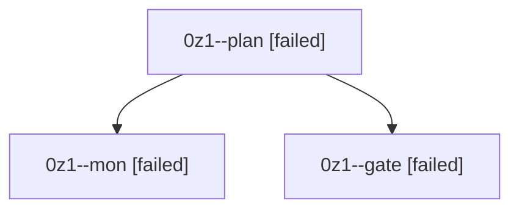

# Session: 0z1

[Agent Hoods](../README.md) / [bbugyi200](../users/bbugyi200/README.md) / [athena](../users/bbugyi200/machines/athena/README.md) / [0z1](../users/bbugyi200/machines/athena/hoods/0z1/README.md) / 0z1

Owner: `bbugyi200.athena` · Hood: `0z1` · Members: 3

## Lineage

The diagram is an optional enhancement; the ordered table below contains the same lineage in accessible text.

| Role | Agent | State | Model / provider | Timing | Commits | Prompt | Chat |
|---|---|---|---|---|---:|---|---|
| plan | 0z1--plan | failed | opus / claude | 2026-10-09T16:00:33.787883+00:00 → 2026-10-09T16:26:29.460408+00:00 | 0 | [Prompt](../agents/bbugyi200.athena.0z1--plan/prompt.md) | [Chat](../agents/bbugyi200.athena.0z1--plan/chat.md) |
| mon | 0z1--mon | failed | opus / claude | 2026-10-09T16:26:22.712314+00:00 → 2026-10-09T16:29:29.342493+00:00 | 0 | — | [Chat](../agents/bbugyi200.athena.0z1--mon/chat.md) |
| gate | 0z1--gate | failed | opus / claude | 2026-10-09T16:25:15.654347+00:00 → 2026-10-09T16:26:23.669691+00:00 | 0 | — | [Chat](../agents/bbugyi200.athena.0z1--gate/chat.md) |

## Neighbors

| Agent | Relation | State |
|---|---|---|
| [0z1.w0](../agents/bbugyi200.athena.0z1.w0/README.md) | descendant | waiting |
