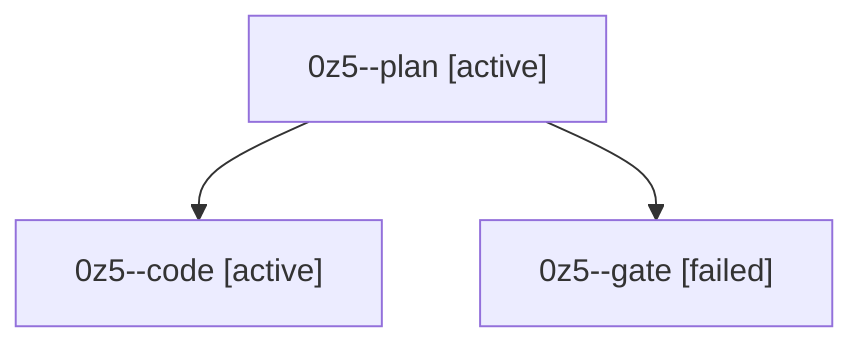

# Session: 0z5

[Agent Hoods](../README.md) / [bbugyi200](../users/bbugyi200/README.md) / [athena](../users/bbugyi200/machines/athena/README.md) / [0z5](../users/bbugyi200/machines/athena/hoods/0z5/README.md) / 0z5

Owner: `bbugyi200.athena` · Hood: `0z5` · Members: 3

## Lineage

The diagram is an optional enhancement; the ordered table below contains the same lineage in accessible text.

| Role | Agent | State | Model / provider | Timing | Commits | Prompt | Chat |
|---|---|---|---|---|---:|---|---|
| plan | 0z5--plan | active | opus / claude | 2026-10-09T18:05:54.653792+00:00 | 0 | [Prompt](../agents/bbugyi200.athena.0z5--plan/prompt.md) | [Chat](../agents/bbugyi200.athena.0z5--plan/chat.md) |
| code | 0z5--code | active | muse-spark-1.3-contributor / muse | 2026-10-09T18:25:01.621345+00:00 | [1](../agents/bbugyi200.athena.0z5--code/README.md#commits) | — | — |
| gate | 0z5--gate | failed | opus / claude | 2026-10-09T18:24:04.925502+00:00 → 2026-10-09T18:24:44.737568+00:00 | 0 | — | [Chat](../agents/bbugyi200.athena.0z5--gate/chat.md) |

## Commits

| Role | Repo | Commit | Subject | Committed |
|---|---|---|---|---|
| code | bob-cli | [`9041927`](https://github.com/bobs-org/bob-cli/commit/9041927833d63d4f2068019c95392d9a8f0529f3) | feat(ref-tasks): add done-aware ref-task locator and read-side contracts | 2026-10-09 14:56:54 EDT |
