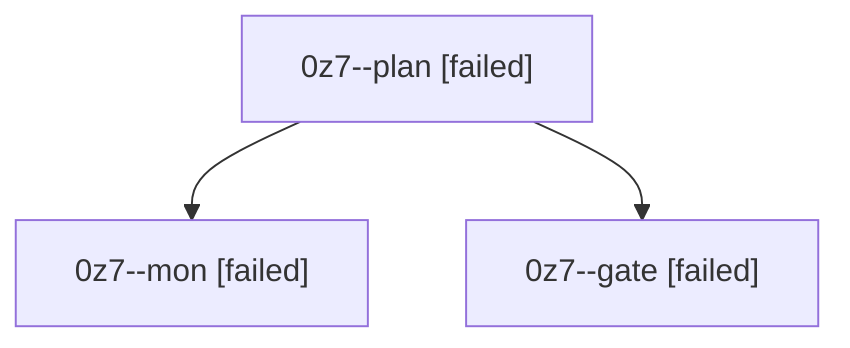

# Session: 0z7

[Agent Hoods](../README.md) / [bbugyi200](../users/bbugyi200/README.md) / [athena](../users/bbugyi200/machines/athena/README.md) / [0z7](../users/bbugyi200/machines/athena/hoods/0z7/README.md) / 0z7

Owner: `bbugyi200.athena` · Hood: `0z7` · Members: 3

## Lineage

The diagram is an optional enhancement; the ordered table below contains the same lineage in accessible text.

| Role | Agent | State | Model / provider | Timing | Commits | Prompt | Chat |
|---|---|---|---|---|---:|---|---|
| plan | 0z7--plan | failed | gpt-6-astra / codex | 2026-10-09T19:36:52.328007+00:00 → 2026-10-09T19:45:03.344254+00:00 | 0 | [Prompt](../agents/bbugyi200.athena.0z7--plan/prompt.md) | [Chat](../agents/bbugyi200.athena.0z7--plan/chat.md) |
| mon | 0z7--mon | failed | gpt-6-astra / codex | 2026-10-09T19:44:56.836738+00:00 → 2026-10-09T19:49:40.473219+00:00 | 0 | — | [Chat](../agents/bbugyi200.athena.0z7--mon/chat.md) |
| gate | 0z7--gate | failed | gpt-6-astra / codex | 2026-10-09T19:44:07.145340+00:00 → 2026-10-09T19:44:58.108555+00:00 | 0 | — | [Chat](../agents/bbugyi200.athena.0z7--gate/chat.md) |
