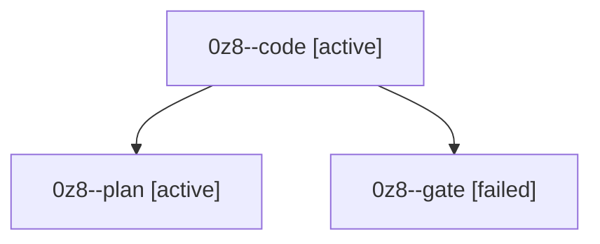

# Session: 0z8

[Agent Hoods](../README.md) / [bbugyi200](../users/bbugyi200/README.md) / [athena](../users/bbugyi200/machines/athena/README.md) / [0z8](../users/bbugyi200/machines/athena/hoods/0z8/README.md) / 0z8

Owner: `bbugyi200.athena` · Hood: `0z8` · Members: 3

## Lineage

The diagram is an optional enhancement; the ordered table below contains the same lineage in accessible text.

| Role | Agent | State | Model / provider | Timing | Commits | Prompt | Chat |
|---|---|---|---|---|---:|---|---|
| code | 0z8--code | active | muse-spark-1.3-contributor / muse | 2026-10-09T20:11:05.481316+00:00 | 0 | — | — |
| plan | 0z8--plan | active | gpt-6-astra / codex | 2026-10-09T20:03:34.722563+00:00 | 0 | [Prompt](../agents/bbugyi200.athena.0z8--plan/prompt.md) | [Chat](../agents/bbugyi200.athena.0z8--plan/chat.md) |
| gate | 0z8--gate | failed | gpt-6-astra / codex | 2026-10-09T20:08:28.342839+00:00 → 2026-10-09T20:09:37.651682+00:00 | 0 | — | [Chat](../agents/bbugyi200.athena.0z8--gate/chat.md) |
