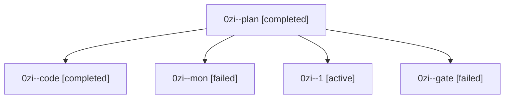

# Session: 0zi

[Agent Hoods](../README.md) / [bbugyi200](../users/bbugyi200/README.md) / [athena](../users/bbugyi200/machines/athena/README.md) / [0zi](../users/bbugyi200/machines/athena/hoods/0zi/README.md) / 0zi

Owner: `bbugyi200.athena` · Hood: `0zi` · Members: 5

## Lineage

The diagram is an optional enhancement; the ordered table below contains the same lineage in accessible text.

| Role | Agent | State | Model / provider | Timing | Commits | Prompt | Chat |
|---|---|---|---|---|---:|---|---|
| plan | 0zi--plan | completed | gpt-6-astra / codex | 2026-10-10T21:38:13.229896+00:00 → 2026-10-10T22:03:35.229586+00:00 | 0 | [Prompt](../agents/bbugyi200.athena.0zi--plan/prompt.md) | [Chat](../agents/bbugyi200.athena.0zi--plan/chat.md) |
| code | 0zi--code | completed | muse-spark-1.3-contributor / muse | 2026-10-10T21:42:11.233441+00:00 → 2026-10-10T22:03:35.229586+00:00 | 0 | — | [Chat](../agents/bbugyi200.athena.0zi--code/chat.md) |
| mon | 0zi--mon | failed | muse-spark-1.3-contributor / muse | 2026-10-10T21:59:10.474509+00:00 → 2026-10-10T22:03:51.551597+00:00 | 0 | — | [Chat](../agents/bbugyi200.athena.0zi--mon/chat.md) |
| 1 | 0zi--1 | active | muse-spark-1.3-contributor / muse | 2026-10-10T22:04:44.783858+00:00 | [1](../agents/bbugyi200.athena.0zi--1/README.md#commits) | [Prompt](../agents/bbugyi200.athena.0zi--1/prompt.md) | — |
| gate | 0zi--gate | failed | gpt-6-astra / codex | 2026-10-10T21:41:27.823627+00:00 → 2026-10-10T21:41:53.929770+00:00 | 0 | — | [Chat](../agents/bbugyi200.athena.0zi--gate/chat.md) |

## Commits

| Role | Repo | Commit | Subject | Committed |
|---|---|---|---|---|
| 1 | bob-cli | [`ab9fbaf`](https://github.com/bobs-org/bob-cli/commit/ab9fbafa42c8559a55bafa61a86ac2d25d365b3c) | feat(highlights): land listen command contract, narration guards, and docs | 2026-10-10 18:11:55 EDT |
