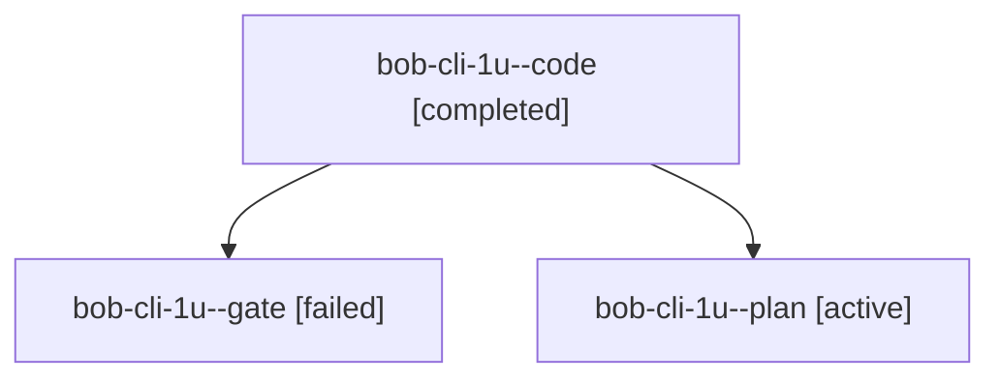

# Session: bob-cli-1u

[Agent Hoods](../README.md) / [bbugyi200](../users/bbugyi200/README.md) / [athena](../users/bbugyi200/machines/athena/README.md) / [bob-cli-1u](../users/bbugyi200/machines/athena/hoods/bob-cli-1u/README.md) / bob-cli-1u

Owner: `bbugyi200.athena` · Hood: `bob-cli-1u` · Members: 3 · Bead: [bob-cli-1u](https://github.com/bobs-org/bob-cli--beads/blob/main/pages/bob-cli-1u/README.md)

## Lineage

The diagram is an optional enhancement; the ordered table below contains the same lineage in accessible text.

| Role | Agent | State | Model / provider | Timing | Commits | Prompt | Chat |
|---|---|---|---|---|---:|---|---|
| code | bob-cli-1u--code | completed | gpt-6-luna / codex | 2026-09-28T10:39:50.390047+00:00 → 2026-09-28T10:55:24.774032+00:00 | 0 | [Prompt](../agents/bbugyi200.athena.bob-cli-1u--code/prompt.md) | [Chat](../agents/bbugyi200.athena.bob-cli-1u--code/chat.md) |
| gate | bob-cli-1u--gate | failed | gpt-6-sol / codex | 2026-09-28T10:38:25.823432+00:00 → 2026-09-28T10:39:08.536929+00:00 | 0 | — | [Chat](../agents/bbugyi200.athena.bob-cli-1u--gate/chat.md) |
| plan | bob-cli-1u--plan | active | gpt-6-sol / codex | 2026-09-28T10:31:56.073185+00:00 | 0 | [Prompt](../agents/bbugyi200.athena.bob-cli-1u--plan/prompt.md) | [Chat](../agents/bbugyi200.athena.bob-cli-1u--plan/chat.md) |
