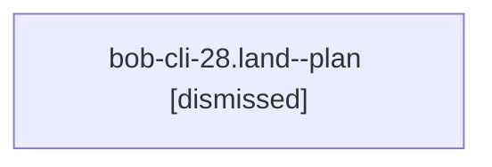

# Session: bob-cli-28.land

[Agent Hoods](../README.md) / [bbugyi200](../users/bbugyi200/README.md) / [athena](../users/bbugyi200/machines/athena/README.md) / [bob-cli-28](../users/bbugyi200/machines/athena/hoods/bob-cli-28/README.md) / bob-cli-28.land

Owner: `bbugyi200.athena` · Hood: `bob-cli-28` · Members: 1 · Bead: [bob-cli-28](https://github.com/bobs-org/bob-cli--beads/blob/main/pages/bob-cli-28/README.md)

## Lineage

The diagram is an optional enhancement; the ordered table below contains the same lineage in accessible text.

| Role | Agent | State | Model / provider | Timing | Commits | Prompt | Chat |
|---|---|---|---|---|---:|---|---|
| plan | bob-cli-28.land--plan | dismissed | gpt-6-sol / codex | 2026-09-27T12:56:12.224837 → 2026-09-27T13:04:26.467743 | 0 | [Prompt](../agents/bbugyi200.athena.bob-cli-28.land--plan/prompt.md) | [Chat](../agents/bbugyi200.athena.bob-cli-28.land--plan/chat.md) |

## Neighbors

| Agent | Relation | State |
|---|---|---|
| [bob-cli-28.1](../agents/bbugyi200.athena.bob-cli-28.1/README.md) | bob-cli-28 hood | active |
| [bob-cli-28.2](../agents/bbugyi200.athena.bob-cli-28.2/README.md) | bob-cli-28 hood | active |
| [bob-cli-28.3](../agents/bbugyi200.athena.bob-cli-28.3/README.md) | bob-cli-28 hood | active |
| [bob-cli-28.4](../agents/bbugyi200.athena.bob-cli-28.4/README.md) | bob-cli-28 hood | active |
