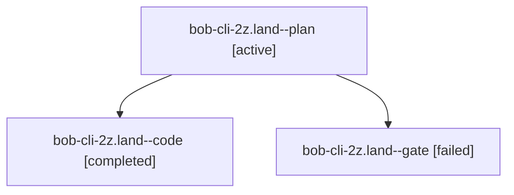

# Session: bob-cli-2z.land

[Agent Hoods](../README.md) / [bbugyi200](../users/bbugyi200/README.md) / [athena](../users/bbugyi200/machines/athena/README.md) / [bob-cli-2z](../users/bbugyi200/machines/athena/hoods/bob-cli-2z/README.md) / bob-cli-2z.land

Owner: `bbugyi200.athena` · Hood: `bob-cli-2z` · Members: 3 · Bead: [bob-cli-2z](https://github.com/bobs-org/bob-cli--beads/blob/main/pages/bob-cli-2z/README.md)

## Lineage

The diagram is an optional enhancement; the ordered table below contains the same lineage in accessible text.

| Role | Agent | State | Model / provider | Timing | Commits | Prompt | Chat |
|---|---|---|---|---|---:|---|---|
| plan | bob-cli-2z.land--plan | active | gpt-6-sol / codex | 2026-10-01T00:30:41.279421+00:00 | 0 | [Prompt](../agents/bbugyi200.athena.bob-cli-2z.land--plan/prompt.md) | [Chat](../agents/bbugyi200.athena.bob-cli-2z.land--plan/chat.md) |
| code | bob-cli-2z.land--code | completed | muse-spark-1.3-contributor / muse | 2026-10-01T00:38:27.680599+00:00 → 2026-10-01T00:47:02.260987+00:00 | 0 | — | [Chat](../agents/bbugyi200.athena.bob-cli-2z.land--code/chat.md) |
| gate | bob-cli-2z.land--gate | failed | gpt-6-sol / codex | 2026-10-01T00:37:53.805693+00:00 → 2026-10-01T00:38:13.753738+00:00 | 0 | — | [Chat](../agents/bbugyi200.athena.bob-cli-2z.land--gate/chat.md) |

## Neighbors

| Agent | Relation | State |
|---|---|---|
| [bob-cli-2z.1](../agents/bbugyi200.athena.bob-cli-2z.1/README.md) | bob-cli-2z hood | active |
| [bob-cli-2z.2](../agents/bbugyi200.athena.bob-cli-2z.2/README.md) | bob-cli-2z hood | active |
| [bob-cli-2z.3](../agents/bbugyi200.athena.bob-cli-2z.3/README.md) | bob-cli-2z hood | active |
| [bob-cli-2z.4](../agents/bbugyi200.athena.bob-cli-2z.4/README.md) | bob-cli-2z hood | active |
