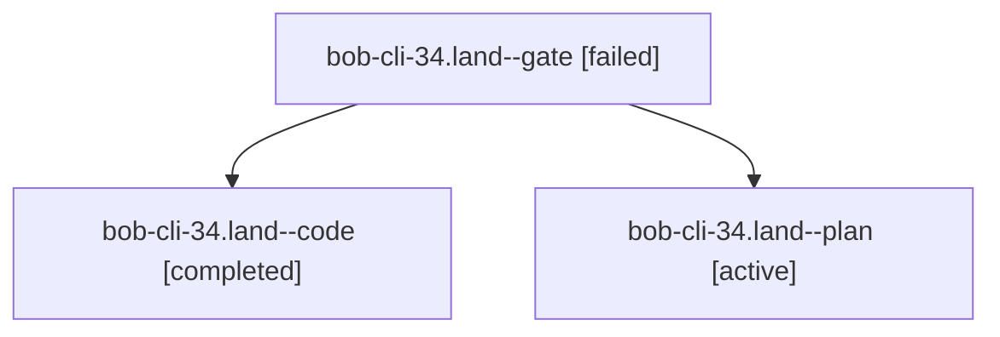

# Session: bob-cli-34.land

[Agent Hoods](../README.md) / [bbugyi200](../users/bbugyi200/README.md) / [athena](../users/bbugyi200/machines/athena/README.md) / [bob-cli-34](../users/bbugyi200/machines/athena/hoods/bob-cli-34/README.md) / bob-cli-34.land

Owner: `bbugyi200.athena` · Hood: `bob-cli-34` · Members: 3 · Bead: [bob-cli-34](https://github.com/bobs-org/bob-cli--beads/blob/main/pages/bob-cli-34/README.md)

## Lineage

The diagram is an optional enhancement; the ordered table below contains the same lineage in accessible text.

| Role | Agent | State | Model / provider | Timing | Commits | Prompt | Chat |
|---|---|---|---|---|---:|---|---|
| gate | bob-cli-34.land--gate | failed | opus / claude | 2026-10-01T05:54:14.858558+00:00 → 2026-10-01T05:54:47.464955+00:00 | 0 | — | [Chat](../agents/bbugyi200.athena.bob-cli-34.land--gate/chat.md) |
| code | bob-cli-34.land--code | completed | muse-spark-1.3-contributor / muse | 2026-10-01T05:55:09.954960+00:00 → 2026-10-01T06:10:33.751134+00:00 | 0 | — | [Chat](../agents/bbugyi200.athena.bob-cli-34.land--code/chat.md) |
| plan | bob-cli-34.land--plan | active | opus / claude | 2026-10-01T05:41:16.317854+00:00 | 0 | [Prompt](../agents/bbugyi200.athena.bob-cli-34.land--plan/prompt.md) | [Chat](../agents/bbugyi200.athena.bob-cli-34.land--plan/chat.md) |

## Neighbors

| Agent | Relation | State |
|---|---|---|
| [bob-cli-34.1](../agents/bbugyi200.athena.bob-cli-34.1/README.md) | bob-cli-34 hood | active |
| [bob-cli-34.2](../agents/bbugyi200.athena.bob-cli-34.2/README.md) | bob-cli-34 hood | active |
| [bob-cli-34.3](../agents/bbugyi200.athena.bob-cli-34.3/README.md) | bob-cli-34 hood | active |
| [bob-cli-34.4](../agents/bbugyi200.athena.bob-cli-34.4/README.md) | bob-cli-34 hood | active |
| [bob-cli-34.5](../agents/bbugyi200.athena.bob-cli-34.5/README.md) | bob-cli-34 hood | active |
