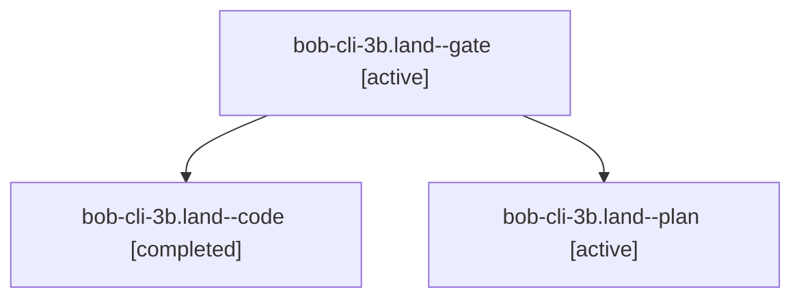

# Session: bob-cli-3b.land

[Agent Hoods](../README.md) / [bbugyi200](../users/bbugyi200/README.md) / [athena](../users/bbugyi200/machines/athena/README.md) / [bob-cli-3b](../users/bbugyi200/machines/athena/hoods/bob-cli-3b/README.md) / bob-cli-3b.land

Owner: `bbugyi200.athena` · Hood: `bob-cli-3b` · Members: 3 · Bead: [bob-cli-3b](https://github.com/bobs-org/bob-cli--beads/blob/main/pages/bob-cli-3b/README.md)

## Lineage

The diagram is an optional enhancement; the ordered table below contains the same lineage in accessible text.

| Role | Agent | State | Model / provider | Timing | Commits | Prompt | Chat |
|---|---|---|---|---|---:|---|---|
| gate | bob-cli-3b.land--gate | active | gpt-6.1-sol / codex | 2026-10-01T18:48:49.988224+00:00 | 0 | — | [Chat](../agents/bbugyi200.athena.bob-cli-3b.land--gate/chat.md) |
| code | bob-cli-3b.land--code | completed | muse-spark-1.3-contributor / muse | 2026-10-01T18:49:22.726207+00:00 → 2026-10-01T19:16:01.096214+00:00 | [1](../agents/bbugyi200.athena.bob-cli-3b.land--code/README.md#commits) | — | [Chat](../agents/bbugyi200.athena.bob-cli-3b.land--code/chat.md) |
| plan | bob-cli-3b.land--plan | active | gpt-6.1-sol / codex | 2026-10-01T18:31:34.013253+00:00 | 0 | [Prompt](../agents/bbugyi200.athena.bob-cli-3b.land--plan/prompt.md) | [Chat](../agents/bbugyi200.athena.bob-cli-3b.land--plan/chat.md) |

## Commits

| Role | Repo | Commit | Subject | Committed |
|---|---|---|---|---|
| code | bob-cli | [`8d9a229`](https://github.com/bobs-org/bob-cli/commit/8d9a2292f2f2c82e6b3a8a953780e8b31daf8d84) | docs(plan): correct daily bob-plan block to the four-chip contract | 2026-10-01 15:14:23 EDT |

## Neighbors

| Agent | Relation | State |
|---|---|---|
| [bob-cli-3b.1](../agents/bbugyi200.athena.bob-cli-3b.1/README.md) | bob-cli-3b hood | active |
| [bob-cli-3b.2](../agents/bbugyi200.athena.bob-cli-3b.2/README.md) | bob-cli-3b hood | active |
| [bob-cli-3b.3](../agents/bbugyi200.athena.bob-cli-3b.3/README.md) | bob-cli-3b hood | active |
