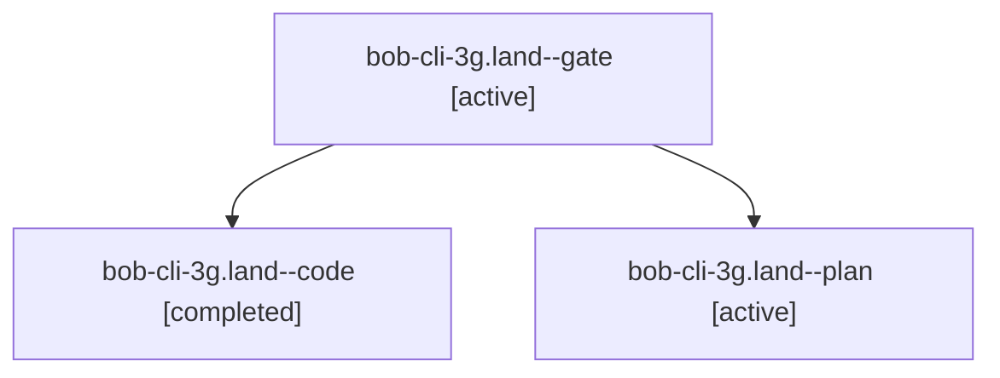

# Session: bob-cli-3g.land

[Agent Hoods](../README.md) / [bbugyi200](../users/bbugyi200/README.md) / [athena](../users/bbugyi200/machines/athena/README.md) / [bob-cli-3g](../users/bbugyi200/machines/athena/hoods/bob-cli-3g/README.md) / bob-cli-3g.land

Owner: `bbugyi200.athena` · Hood: `bob-cli-3g` · Members: 3 · Bead: [bob-cli-3g](https://github.com/bobs-org/bob-cli--beads/blob/main/pages/bob-cli-3g/README.md)

## Lineage

The diagram is an optional enhancement; the ordered table below contains the same lineage in accessible text.

| Role | Agent | State | Model / provider | Timing | Commits | Prompt | Chat |
|---|---|---|---|---|---:|---|---|
| gate | bob-cli-3g.land--gate | active | grok-4.7 / grok | 2026-10-02T00:25:10.076217+00:00 | 0 | — | [Chat](../agents/bbugyi200.athena.bob-cli-3g.land--gate/chat.md) |
| code | bob-cli-3g.land--code | completed | muse-spark-1.3-contributor / muse | 2026-10-02T00:26:00.833479+00:00 → 2026-10-02T00:35:08.053275+00:00 | [1](../agents/bbugyi200.athena.bob-cli-3g.land--code/README.md#commits) | — | [Chat](../agents/bbugyi200.athena.bob-cli-3g.land--code/chat.md) |
| plan | bob-cli-3g.land--plan | active | grok-4.7 / grok | 2026-10-02T00:09:31.120146+00:00 | 0 | [Prompt](../agents/bbugyi200.athena.bob-cli-3g.land--plan/prompt.md) | [Chat](../agents/bbugyi200.athena.bob-cli-3g.land--plan/chat.md) |

## Commits

| Role | Repo | Commit | Subject | Committed |
|---|---|---|---|---|
| code | bob-cli | [`f11a9f8`](https://github.com/bobs-org/bob-cli/commit/f11a9f81256a10ee812e47c3a203797262e9c381) | docs(plan): update plan surfaces to freshness namespace v4 for tiered walk | 2026-10-01 20:33:20 EDT |

## Neighbors

| Agent | Relation | State |
|---|---|---|
| [bob-cli-3g.1](../agents/bbugyi200.athena.bob-cli-3g.1/README.md) | bob-cli-3g hood | active |
| [bob-cli-3g.2](../agents/bbugyi200.athena.bob-cli-3g.2/README.md) | bob-cli-3g hood | active |
| [bob-cli-3g.3](../agents/bbugyi200.athena.bob-cli-3g.3/README.md) | bob-cli-3g hood | active |
| [bob-cli-3g.4](../agents/bbugyi200.athena.bob-cli-3g.4/README.md) | bob-cli-3g hood | active |
