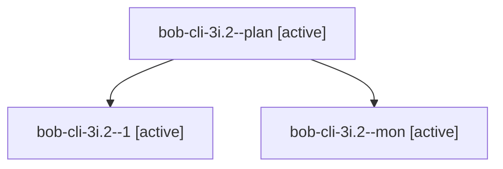

# Session: bob-cli-3i.2

[Agent Hoods](../README.md) / [bbugyi200](../users/bbugyi200/README.md) / [athena](../users/bbugyi200/machines/athena/README.md) / [bob-cli-3i](../users/bbugyi200/machines/athena/hoods/bob-cli-3i/README.md) / bob-cli-3i.2

Owner: `bbugyi200.athena` · Hood: `bob-cli-3i` · Members: 3 · Bead: [bob-cli-3i.2](https://github.com/bobs-org/bob-cli--beads/blob/main/pages/bob-cli-3i/bob-cli-3i.2.md)

## Lineage

The diagram is an optional enhancement; the ordered table below contains the same lineage in accessible text.

| Role | Agent | State | Model / provider | Timing | Commits | Prompt | Chat |
|---|---|---|---|---|---:|---|---|
| plan | bob-cli-3i.2--plan | active | muse-spark-1.3-contributor / muse | 2026-10-02T14:39:38.439241+00:00 | 0 | [Prompt](../agents/bbugyi200.athena.bob-cli-3i.2--plan/prompt.md) | [Chat](../agents/bbugyi200.athena.bob-cli-3i.2--plan/chat.md) |
| 1 | bob-cli-3i.2--1 | active | muse-spark-1.3-contributor / muse | 2026-10-02T15:00:19.313939+00:00 | 0 | [Prompt](../agents/bbugyi200.athena.bob-cli-3i.2--1/prompt.md) | [Chat](../agents/bbugyi200.athena.bob-cli-3i.2--1/chat.md) |
| mon | bob-cli-3i.2--mon | active | muse-spark-1.3-contributor / muse | 2026-10-02T14:55:17.985761+00:00 | 0 | — | [Chat](../agents/bbugyi200.athena.bob-cli-3i.2--mon/chat.md) |

## Neighbors

| Agent | Relation | State |
|---|---|---|
| [bob-cli-3i.1](../agents/bbugyi200.athena.bob-cli-3i.1/README.md) | bob-cli-3i hood | active |
| [bob-cli-3i.3](bbugyi200.athena.bob-cli-3i.3.md) (session · 3) | bob-cli-3i hood | active 3 |
| [bob-cli-3i.land](bbugyi200.athena.bob-cli-3i.land.md) (session · 3) | bob-cli-3i hood | active 2, completed 1 |
