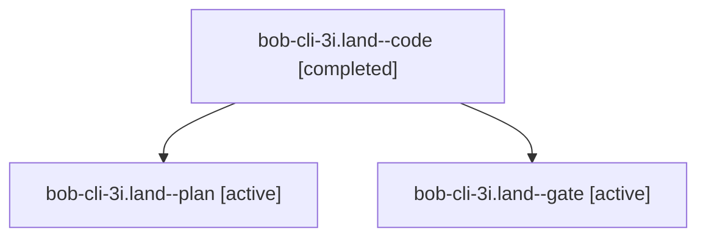

# Session: bob-cli-3i.land

[Agent Hoods](../README.md) / [bbugyi200](../users/bbugyi200/README.md) / [athena](../users/bbugyi200/machines/athena/README.md) / [bob-cli-3i](../users/bbugyi200/machines/athena/hoods/bob-cli-3i/README.md) / bob-cli-3i.land

Owner: `bbugyi200.athena` · Hood: `bob-cli-3i` · Members: 3 · Bead: [bob-cli-3i](https://github.com/bobs-org/bob-cli--beads/blob/main/pages/bob-cli-3i/README.md)

## Lineage

The diagram is an optional enhancement; the ordered table below contains the same lineage in accessible text.

| Role | Agent | State | Model / provider | Timing | Commits | Prompt | Chat |
|---|---|---|---|---|---:|---|---|
| code | bob-cli-3i.land--code | completed | muse-spark-1.3-contributor / muse | 2026-10-02T15:36:39.738711+00:00 → 2026-10-02T15:49:02.873928+00:00 | [1](../agents/bbugyi200.athena.bob-cli-3i.land--code/README.md#commits) | — | [Chat](../agents/bbugyi200.athena.bob-cli-3i.land--code/chat.md) |
| plan | bob-cli-3i.land--plan | active | gpt-6.1-sol / codex | 2026-10-02T15:23:41.800490+00:00 | 0 | [Prompt](../agents/bbugyi200.athena.bob-cli-3i.land--plan/prompt.md) | [Chat](../agents/bbugyi200.athena.bob-cli-3i.land--plan/chat.md) |
| gate | bob-cli-3i.land--gate | active | gpt-6.1-sol / codex | 2026-10-02T15:35:26.519776+00:00 | 0 | — | [Chat](../agents/bbugyi200.athena.bob-cli-3i.land--gate/chat.md) |

## Commits

| Role | Repo | Commit | Subject | Committed |
|---|---|---|---|---|
| code | bob-cli | [`0791fb6`](https://github.com/bobs-org/bob-cli/commit/0791fb6ae5d1767110854a9481c6501af8613246) | fix(capture): preserve first-touch order in task block output | 2026-10-02 11:46:35 EDT |

## Neighbors

| Agent | Relation | State |
|---|---|---|
| [bob-cli-3i.1](../agents/bbugyi200.athena.bob-cli-3i.1/README.md) | bob-cli-3i hood | active |
| [bob-cli-3i.2](bbugyi200.athena.bob-cli-3i.2.md) (session · 3) | bob-cli-3i hood | active 3 |
| [bob-cli-3i.3](bbugyi200.athena.bob-cli-3i.3.md) (session · 3) | bob-cli-3i hood | active 3 |
