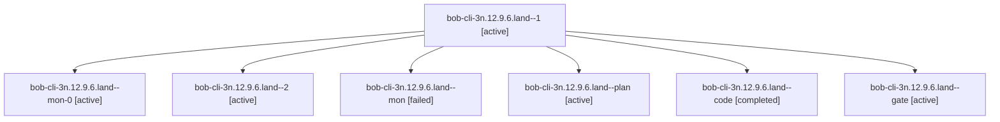

# Session: bob-cli-3n.12.9.6.land

[Agent Hoods](../README.md) / [bbugyi200](../users/bbugyi200/README.md) / [athena](../users/bbugyi200/machines/athena/README.md) / [bob-cli-3n](../users/bbugyi200/machines/athena/hoods/bob-cli-3n/README.md) / bob-cli-3n.12.9.6.land

Owner: `bbugyi200.athena` · Hood: `bob-cli-3n` · Members: 7 · Bead: [bob-cli-3n.12.9.6](https://github.com/bobs-org/bob-cli--beads/blob/main/pages/bob-cli-3n/bob-cli-3n.12.9.6.md)

## Lineage

The diagram is an optional enhancement; the ordered table below contains the same lineage in accessible text.

| Role | Agent | State | Model / provider | Timing | Commits | Prompt | Chat |
|---|---|---|---|---|---:|---|---|
| 1 | bob-cli-3n.12.9.6.land--1 | active | muse-spark-1.3-contributor / muse | 2026-10-03T08:57:06.697748+00:00 | 0 | [Prompt](../agents/bbugyi200.athena.bob-cli-3n.12.9.6.land--1/prompt.md) | [Chat](../agents/bbugyi200.athena.bob-cli-3n.12.9.6.land--1/chat.md) |
| mon-0 | bob-cli-3n.12.9.6.land--mon-0 | active | muse-spark-1.3-contributor / muse | 2026-10-03T08:58:27.210570+00:00 | 0 | — | [Chat](../agents/bbugyi200.athena.bob-cli-3n.12.9.6.land--mon-0/chat.md) |
| 2 | bob-cli-3n.12.9.6.land--2 | active | muse-spark-1.3-contributor / muse | 2026-10-03T09:00:45.758867+00:00 | 0 | [Prompt](../agents/bbugyi200.athena.bob-cli-3n.12.9.6.land--2/prompt.md) | [Chat](../agents/bbugyi200.athena.bob-cli-3n.12.9.6.land--2/chat.md) |
| mon | bob-cli-3n.12.9.6.land--mon | failed | muse-spark-1.3-contributor / muse | 2026-10-03T08:54:25.022537+00:00 → 2026-10-03T08:56:54.089837+00:00 | 0 | — | [Chat](../agents/bbugyi200.athena.bob-cli-3n.12.9.6.land--mon/chat.md) |
| plan | bob-cli-3n.12.9.6.land--plan | active | opus / claude | 2026-10-03T07:53:35.454669+00:00 | 0 | [Prompt](../agents/bbugyi200.athena.bob-cli-3n.12.9.6.land--plan/prompt.md) | [Chat](../agents/bbugyi200.athena.bob-cli-3n.12.9.6.land--plan/chat.md) |
| code | bob-cli-3n.12.9.6.land--code | completed | muse-spark-1.3-contributor / muse | 2026-10-03T08:38:33.734207+00:00 → 2026-10-03T08:54:58.610391+00:00 | [1](../agents/bbugyi200.athena.bob-cli-3n.12.9.6.land--code/README.md#commits) | — | [Chat](../agents/bbugyi200.athena.bob-cli-3n.12.9.6.land--code/chat.md) |
| gate | bob-cli-3n.12.9.6.land--gate | active | opus / claude | 2026-10-03T08:37:24.121553+00:00 | 0 | — | [Chat](../agents/bbugyi200.athena.bob-cli-3n.12.9.6.land--gate/chat.md) |

## Commits

| Role | Repo | Commit | Subject | Committed |
|---|---|---|---|---|
| code | bob-cli | [`6192017`](https://github.com/bobs-org/bob-cli/commit/619201720934e641db800d7d2e86a8f6ac714193) | docs(task-deps): DP30 Reading rows in 7.4; drop unreachable legacy branch | 2026-10-03 04:52:53 EDT |

## Neighbors

| Agent | Relation | State |
|---|---|---|
| [bob-cli-3n.12.9.6.1](../agents/bbugyi200.athena.bob-cli-3n.12.9.6.1/README.md) | bob-cli-3n.12.9.6 hood | active |
| [bob-cli-3n.12.9.6.2](../agents/bbugyi200.athena.bob-cli-3n.12.9.6.2/README.md) | bob-cli-3n.12.9.6 hood | active |
| [bob-cli-3n.12.9.6.3](../agents/bbugyi200.athena.bob-cli-3n.12.9.6.3/README.md) | bob-cli-3n.12.9.6 hood | active |
| [bob-cli-3n.12.9.6.4](../agents/bbugyi200.athena.bob-cli-3n.12.9.6.4/README.md) | bob-cli-3n.12.9.6 hood | active |
| [bob-cli-3n.12.9.6.5](../agents/bbugyi200.athena.bob-cli-3n.12.9.6.5/README.md) | bob-cli-3n.12.9.6 hood | active |
| [bob-cli-3n.12.9.1](../agents/bbugyi200.athena.bob-cli-3n.12.9.1/README.md) | bob-cli-3n.12.9 hood | active |
| [bob-cli-3n.12.9.2](bbugyi200.athena.bob-cli-3n.12.9.2.md) (session · 3) | bob-cli-3n.12.9 hood | active 3 |
| [bob-cli-3n.12.9.3](../agents/bbugyi200.athena.bob-cli-3n.12.9.3/README.md) | bob-cli-3n.12.9 hood | active |
| [bob-cli-3n.12.9.4](../agents/bbugyi200.athena.bob-cli-3n.12.9.4/README.md) | bob-cli-3n.12.9 hood | active |
| [bob-cli-3n.12.9.5](bbugyi200.athena.bob-cli-3n.12.9.5.md) (session · 3) | bob-cli-3n.12.9 hood | active 3 |
| [bob-cli-3n.12.9.land](bbugyi200.athena.bob-cli-3n.12.9.land.md) (session · 3) | bob-cli-3n.12.9 hood | active 3 |
| [bob-cli-3n.12.1](../agents/bbugyi200.athena.bob-cli-3n.12.1/README.md) | bob-cli-3n.12 hood | active |
| [bob-cli-3n.12.2](../agents/bbugyi200.athena.bob-cli-3n.12.2/README.md) | bob-cli-3n.12 hood | active |
| [bob-cli-3n.12.3](../agents/bbugyi200.athena.bob-cli-3n.12.3/README.md) | bob-cli-3n.12 hood | active |
| [bob-cli-3n.12.4](../agents/bbugyi200.athena.bob-cli-3n.12.4/README.md) | bob-cli-3n.12 hood | active |
| [bob-cli-3n.12.5](../agents/bbugyi200.athena.bob-cli-3n.12.5/README.md) | bob-cli-3n.12 hood | active |
| [bob-cli-3n.12.6](../agents/bbugyi200.athena.bob-cli-3n.12.6/README.md) | bob-cli-3n.12 hood | active |
| [bob-cli-3n.12.7](../agents/bbugyi200.athena.bob-cli-3n.12.7/README.md) | bob-cli-3n.12 hood | active |
| [bob-cli-3n.12.8](../agents/bbugyi200.athena.bob-cli-3n.12.8/README.md) | bob-cli-3n.12 hood | active |
| [bob-cli-3n.12.land](bbugyi200.athena.bob-cli-3n.12.land.md) (session · 3) | bob-cli-3n.12 hood | active 3 |
| [bob-cli-3n.1](../agents/bbugyi200.athena.bob-cli-3n.1/README.md) | bob-cli-3n hood | active |
| [bob-cli-3n.10](../agents/bbugyi200.athena.bob-cli-3n.10/README.md) | bob-cli-3n hood | active |
| [bob-cli-3n.11](../agents/bbugyi200.athena.bob-cli-3n.11/README.md) | bob-cli-3n hood | active |
| [bob-cli-3n.2](../agents/bbugyi200.athena.bob-cli-3n.2/README.md) | bob-cli-3n hood | active |
| [bob-cli-3n.3](../agents/bbugyi200.athena.bob-cli-3n.3/README.md) | bob-cli-3n hood | active |
| [bob-cli-3n.4](../agents/bbugyi200.athena.bob-cli-3n.4/README.md) | bob-cli-3n hood | active |
| [bob-cli-3n.5](../agents/bbugyi200.athena.bob-cli-3n.5/README.md) | bob-cli-3n hood | active |
| [bob-cli-3n.6](../agents/bbugyi200.athena.bob-cli-3n.6/README.md) | bob-cli-3n hood | active |
| [bob-cli-3n.7](../agents/bbugyi200.athena.bob-cli-3n.7/README.md) | bob-cli-3n hood | active |
| [bob-cli-3n.8](../agents/bbugyi200.athena.bob-cli-3n.8/README.md) | bob-cli-3n hood | active |
| [bob-cli-3n.9](../agents/bbugyi200.athena.bob-cli-3n.9/README.md) | bob-cli-3n hood | active |
| [bob-cli-3n.land](bbugyi200.athena.bob-cli-3n.land.md) (session · 3) | bob-cli-3n hood | active 3 |
