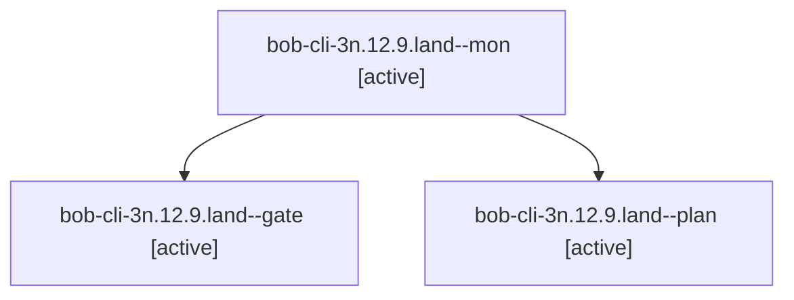

# Session: bob-cli-3n.12.9.land

[Agent Hoods](../README.md) / [bbugyi200](../users/bbugyi200/README.md) / [athena](../users/bbugyi200/machines/athena/README.md) / [bob-cli-3n](../users/bbugyi200/machines/athena/hoods/bob-cli-3n/README.md) / bob-cli-3n.12.9.land

Owner: `bbugyi200.athena` · Hood: `bob-cli-3n` · Members: 3 · Bead: [bob-cli-3n.12.9](https://github.com/bobs-org/bob-cli--beads/blob/main/pages/bob-cli-3n/bob-cli-3n.12.9.md)

## Lineage

The diagram is an optional enhancement; the ordered table below contains the same lineage in accessible text.

| Role | Agent | State | Model / provider | Timing | Commits | Prompt | Chat |
|---|---|---|---|---|---:|---|---|
| mon | bob-cli-3n.12.9.land--mon | active | opus / claude | 2026-10-03T06:54:20.117439+00:00 | 0 | — | [Chat](../agents/bbugyi200.athena.bob-cli-3n.12.9.land--mon/chat.md) |
| gate | bob-cli-3n.12.9.land--gate | active | opus / claude | 2026-10-03T06:53:50.510470+00:00 | 0 | — | [Chat](../agents/bbugyi200.athena.bob-cli-3n.12.9.land--gate/chat.md) |
| plan | bob-cli-3n.12.9.land--plan | active | opus / claude | 2026-10-03T06:35:38.641078+00:00 | 0 | [Prompt](../agents/bbugyi200.athena.bob-cli-3n.12.9.land--plan/prompt.md) | [Chat](../agents/bbugyi200.athena.bob-cli-3n.12.9.land--plan/chat.md) |

## Neighbors

| Agent | Relation | State |
|---|---|---|
| [bob-cli-3n.12.9.1](../agents/bbugyi200.athena.bob-cli-3n.12.9.1/README.md) | bob-cli-3n.12.9 hood | active |
| [bob-cli-3n.12.9.2](bbugyi200.athena.bob-cli-3n.12.9.2.md) (session · 3) | bob-cli-3n.12.9 hood | active 3 |
| [bob-cli-3n.12.9.3](../agents/bbugyi200.athena.bob-cli-3n.12.9.3/README.md) | bob-cli-3n.12.9 hood | active |
| [bob-cli-3n.12.9.4](../agents/bbugyi200.athena.bob-cli-3n.12.9.4/README.md) | bob-cli-3n.12.9 hood | active |
| [bob-cli-3n.12.9.5](bbugyi200.athena.bob-cli-3n.12.9.5.md) (session · 3) | bob-cli-3n.12.9 hood | active 3 |
| [bob-cli-3n.12.9.6.1](../agents/bbugyi200.athena.bob-cli-3n.12.9.6.1/README.md) | bob-cli-3n.12.9 hood | active |
| [bob-cli-3n.12.9.6.2](../agents/bbugyi200.athena.bob-cli-3n.12.9.6.2/README.md) | bob-cli-3n.12.9 hood | active |
| [bob-cli-3n.12.9.6.3](../agents/bbugyi200.athena.bob-cli-3n.12.9.6.3/README.md) | bob-cli-3n.12.9 hood | active |
| [bob-cli-3n.12.9.6.4](../agents/bbugyi200.athena.bob-cli-3n.12.9.6.4/README.md) | bob-cli-3n.12.9 hood | active |
| [bob-cli-3n.12.9.6.5](../agents/bbugyi200.athena.bob-cli-3n.12.9.6.5/README.md) | bob-cli-3n.12.9 hood | active |
| [bob-cli-3n.12.9.6.land](bbugyi200.athena.bob-cli-3n.12.9.6.land.md) (session · 7) | bob-cli-3n.12.9 hood | active 5, completed 1, failed 1 |
| [bob-cli-3n.12.1](../agents/bbugyi200.athena.bob-cli-3n.12.1/README.md) | bob-cli-3n.12 hood | active |
| [bob-cli-3n.12.2](../agents/bbugyi200.athena.bob-cli-3n.12.2/README.md) | bob-cli-3n.12 hood | active |
| [bob-cli-3n.12.3](../agents/bbugyi200.athena.bob-cli-3n.12.3/README.md) | bob-cli-3n.12 hood | active |
| [bob-cli-3n.12.4](../agents/bbugyi200.athena.bob-cli-3n.12.4/README.md) | bob-cli-3n.12 hood | active |
| [bob-cli-3n.12.5](../agents/bbugyi200.athena.bob-cli-3n.12.5/README.md) | bob-cli-3n.12 hood | active |
| [bob-cli-3n.12.6](../agents/bbugyi200.athena.bob-cli-3n.12.6/README.md) | bob-cli-3n.12 hood | active |
| [bob-cli-3n.12.7](../agents/bbugyi200.athena.bob-cli-3n.12.7/README.md) | bob-cli-3n.12 hood | active |
| [bob-cli-3n.12.8](../agents/bbugyi200.athena.bob-cli-3n.12.8/README.md) | bob-cli-3n.12 hood | active |
| [bob-cli-3n.12.land](bbugyi200.athena.bob-cli-3n.12.land.md) (session · 3) | bob-cli-3n.12 hood | active 3 |
| [bob-cli-3n.1](../agents/bbugyi200.athena.bob-cli-3n.1/README.md) | bob-cli-3n hood | active |
| [bob-cli-3n.10](../agents/bbugyi200.athena.bob-cli-3n.10/README.md) | bob-cli-3n hood | active |
| [bob-cli-3n.11](../agents/bbugyi200.athena.bob-cli-3n.11/README.md) | bob-cli-3n hood | active |
| [bob-cli-3n.2](../agents/bbugyi200.athena.bob-cli-3n.2/README.md) | bob-cli-3n hood | active |
| [bob-cli-3n.3](../agents/bbugyi200.athena.bob-cli-3n.3/README.md) | bob-cli-3n hood | active |
| [bob-cli-3n.4](../agents/bbugyi200.athena.bob-cli-3n.4/README.md) | bob-cli-3n hood | active |
| [bob-cli-3n.5](../agents/bbugyi200.athena.bob-cli-3n.5/README.md) | bob-cli-3n hood | active |
| [bob-cli-3n.6](../agents/bbugyi200.athena.bob-cli-3n.6/README.md) | bob-cli-3n hood | active |
| [bob-cli-3n.7](../agents/bbugyi200.athena.bob-cli-3n.7/README.md) | bob-cli-3n hood | active |
| [bob-cli-3n.8](../agents/bbugyi200.athena.bob-cli-3n.8/README.md) | bob-cli-3n hood | active |
| [bob-cli-3n.9](../agents/bbugyi200.athena.bob-cli-3n.9/README.md) | bob-cli-3n hood | active |
| [bob-cli-3n.land](bbugyi200.athena.bob-cli-3n.land.md) (session · 3) | bob-cli-3n hood | active 3 |
