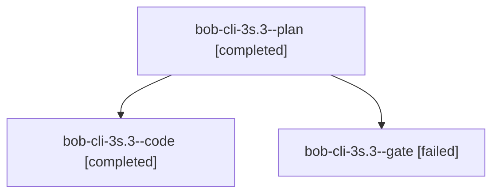

# Session: bob-cli-3s.3

[Agent Hoods](../README.md) / [bbugyi200](../users/bbugyi200/README.md) / [athena](../users/bbugyi200/machines/athena/README.md) / [bob-cli-3s](../users/bbugyi200/machines/athena/hoods/bob-cli-3s/README.md) / bob-cli-3s.3

Owner: `bbugyi200.athena` · Hood: `bob-cli-3s` · Members: 3 · Bead: [bob-cli-3s.3](https://github.com/bobs-org/bob-cli--beads/blob/main/pages/bob-cli-3s/bob-cli-3s.3.md)

## Lineage

The diagram is an optional enhancement; the ordered table below contains the same lineage in accessible text.

| Role | Agent | State | Model / provider | Timing | Commits | Prompt | Chat |
|---|---|---|---|---|---:|---|---|
| plan | bob-cli-3s.3--plan | completed | grok-4.7 / grok | 2026-10-03T10:18:21.914811+00:00 → 2026-10-03T10:41:10.059814+00:00 | 0 | [Prompt](../agents/bbugyi200.athena.bob-cli-3s.3--plan/prompt.md) | [Chat](../agents/bbugyi200.athena.bob-cli-3s.3--plan/chat.md) |
| code | bob-cli-3s.3--code | completed | muse-spark-1.3-contributor / muse | 2026-10-03T10:27:32.964791+00:00 → 2026-10-03T10:41:10.059814+00:00 | [1](../agents/bbugyi200.athena.bob-cli-3s.3--code/README.md#commits) | — | [Chat](../agents/bbugyi200.athena.bob-cli-3s.3--code/chat.md) |
| gate | bob-cli-3s.3--gate | failed | grok-4.7 / grok | 2026-10-03T10:26:56.992952+00:00 → 2026-10-03T10:27:17.115851+00:00 | 0 | — | [Chat](../agents/bbugyi200.athena.bob-cli-3s.3--gate/chat.md) |

## Commits

| Role | Repo | Commit | Subject | Committed |
|---|---|---|---|---|
| code | bob-cli | [`b4a5022`](https://github.com/bobs-org/bob-cli/commit/b4a5022515e08c764299614c1c473a5199867608) | refactor(native): split task\_status\_hooks\_write into focused modules | 2026-10-03 06:40:14 EDT |

## Neighbors

| Agent | Relation | State |
|---|---|---|
| [bob-cli-3s.1](bbugyi200.athena.bob-cli-3s.1.md) (session · 3) | bob-cli-3s hood | completed 2, failed 1 |
| [bob-cli-3s.2](bbugyi200.athena.bob-cli-3s.2.md) (session · 3) | bob-cli-3s hood | completed 2, failed 1 |
| [bob-cli-3s.4](bbugyi200.athena.bob-cli-3s.4.md) (session · 3) | bob-cli-3s hood | completed 2, failed 1 |
| [bob-cli-3s.5](bbugyi200.athena.bob-cli-3s.5.md) (session · 3) | bob-cli-3s hood | completed 2, failed 1 |
| [bob-cli-3s.land](bbugyi200.athena.bob-cli-3s.land.md) (session · 3) | bob-cli-3s hood | completed 2, failed 1 |
