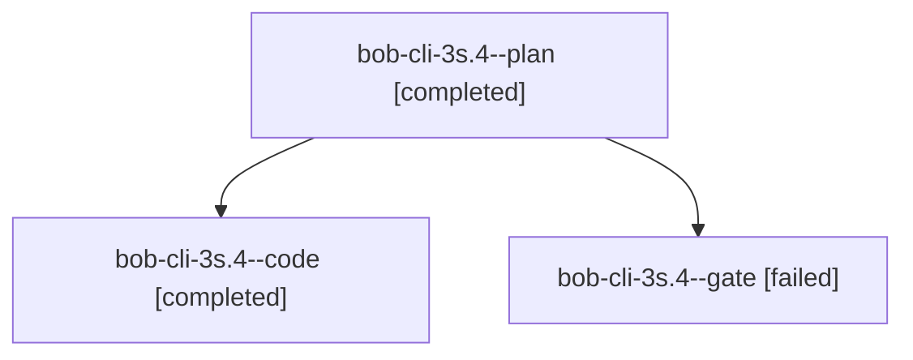

# Session: bob-cli-3s.4

[Agent Hoods](../README.md) / [bbugyi200](../users/bbugyi200/README.md) / [athena](../users/bbugyi200/machines/athena/README.md) / [bob-cli-3s](../users/bbugyi200/machines/athena/hoods/bob-cli-3s/README.md) / bob-cli-3s.4

Owner: `bbugyi200.athena` · Hood: `bob-cli-3s` · Members: 3 · Bead: [bob-cli-3s.4](https://github.com/bobs-org/bob-cli--beads/blob/main/pages/bob-cli-3s/bob-cli-3s.4.md)

## Lineage

The diagram is an optional enhancement; the ordered table below contains the same lineage in accessible text.

| Role | Agent | State | Model / provider | Timing | Commits | Prompt | Chat |
|---|---|---|---|---|---:|---|---|
| plan | bob-cli-3s.4--plan | completed | gpt-6.1-sol / codex | 2026-10-03T10:41:11.576788+00:00 → 2026-10-03T11:06:14.838156+00:00 | 0 | [Prompt](../agents/bbugyi200.athena.bob-cli-3s.4--plan/prompt.md) | [Chat](../agents/bbugyi200.athena.bob-cli-3s.4--plan/chat.md) |
| code | bob-cli-3s.4--code | completed | muse-spark-1.3-contributor / muse | 2026-10-03T10:49:07.864004+00:00 → 2026-10-03T11:06:14.838156+00:00 | [1](../agents/bbugyi200.athena.bob-cli-3s.4--code/README.md#commits) | — | [Chat](../agents/bbugyi200.athena.bob-cli-3s.4--code/chat.md) |
| gate | bob-cli-3s.4--gate | failed | gpt-6.1-sol / codex | 2026-10-03T10:48:29.013976+00:00 → 2026-10-03T10:48:50.456375+00:00 | 0 | — | [Chat](../agents/bbugyi200.athena.bob-cli-3s.4--gate/chat.md) |

## Commits

| Role | Repo | Commit | Subject | Committed |
|---|---|---|---|---|
| code | bob-cli | [`c2c54a4`](https://github.com/bobs-org/bob-cli/commit/c2c54a4b5da85a67555f5f7d085ad84d37630400) | refactor(capture-clip): split capture\_clip into focused modules | 2026-10-03 07:04:42 EDT |

## Neighbors

| Agent | Relation | State |
|---|---|---|
| [bob-cli-3s.1](bbugyi200.athena.bob-cli-3s.1.md) (session · 3) | bob-cli-3s hood | completed 2, failed 1 |
| [bob-cli-3s.2](bbugyi200.athena.bob-cli-3s.2.md) (session · 3) | bob-cli-3s hood | completed 2, failed 1 |
| [bob-cli-3s.3](bbugyi200.athena.bob-cli-3s.3.md) (session · 3) | bob-cli-3s hood | completed 2, failed 1 |
| [bob-cli-3s.5](bbugyi200.athena.bob-cli-3s.5.md) (session · 3) | bob-cli-3s hood | completed 2, failed 1 |
| [bob-cli-3s.land](bbugyi200.athena.bob-cli-3s.land.md) (session · 3) | bob-cli-3s hood | completed 2, failed 1 |
