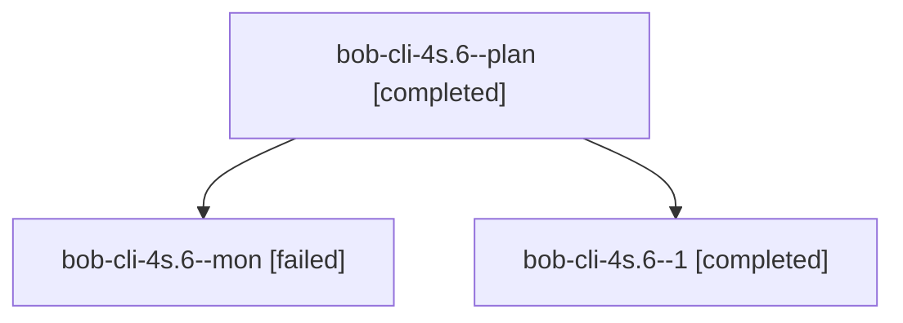

# Session: bob-cli-4s.6

[Agent Hoods](../README.md) / [bbugyi200](../users/bbugyi200/README.md) / [athena](../users/bbugyi200/machines/athena/README.md) / [bob-cli-4s](../users/bbugyi200/machines/athena/hoods/bob-cli-4s/README.md) / bob-cli-4s.6

Owner: `bbugyi200.athena` · Hood: `bob-cli-4s` · Members: 3 · Bead: [bob-cli-4s.6](https://github.com/bobs-org/bob-cli--beads/blob/main/pages/bob-cli-4s/bob-cli-4s.6.md)

## Lineage

The diagram is an optional enhancement; the ordered table below contains the same lineage in accessible text.

| Role | Agent | State | Model / provider | Timing | Commits | Prompt | Chat |
|---|---|---|---|---|---:|---|---|
| plan | bob-cli-4s.6--plan | completed | muse-spark-1.3-contributor / muse | 2026-10-06T21:32:10.353026+00:00 → 2026-10-06T21:47:29.790889+00:00 | 0 | [Prompt](../agents/bbugyi200.athena.bob-cli-4s.6--plan/prompt.md) | [Chat](../agents/bbugyi200.athena.bob-cli-4s.6--plan/chat.md) |
| mon | bob-cli-4s.6--mon | failed | muse-spark-1.3-contributor / muse | 2026-10-06T21:47:04.315894+00:00 → 2026-10-06T22:33:28.359363+00:00 | 0 | — | [Chat](../agents/bbugyi200.athena.bob-cli-4s.6--mon/chat.md) |
| 1 | bob-cli-4s.6--1 | completed | muse-spark-1.3-contributor / muse | 2026-10-06T22:33:51.392608+00:00 → 2026-10-06T22:55:20.435706+00:00 | [1](../agents/bbugyi200.athena.bob-cli-4s.6--1/README.md#commits) | [Prompt](../agents/bbugyi200.athena.bob-cli-4s.6--1/prompt.md) | [Chat](../agents/bbugyi200.athena.bob-cli-4s.6--1/chat.md) |

## Commits

| Role | Repo | Commit | Subject | Committed |
|---|---|---|---|---|
| 1 | bob-cli | [`fe1c05f`](https://github.com/bobs-org/bob-cli/commit/fe1c05f067e8843863fd3ce164e572511063515c) | docs(highlights): record live-verify results for listen attach flow | 2026-10-06 18:54:20 EDT |

## Neighbors

| Agent | Relation | State |
|---|---|---|
| [bob-cli-4s.1](../agents/bbugyi200.athena.bob-cli-4s.1/README.md) | bob-cli-4s hood | completed |
| [bob-cli-4s.2](../agents/bbugyi200.athena.bob-cli-4s.2/README.md) | bob-cli-4s hood | completed |
| [bob-cli-4s.3](../agents/bbugyi200.athena.bob-cli-4s.3/README.md) | bob-cli-4s hood | completed |
| [bob-cli-4s.4](../agents/bbugyi200.athena.bob-cli-4s.4/README.md) | bob-cli-4s hood | completed |
| [bob-cli-4s.5](../agents/bbugyi200.athena.bob-cli-4s.5/README.md) | bob-cli-4s hood | completed |
| [bob-cli-4s.land](bbugyi200.athena.bob-cli-4s.land.md) (session · 3) | bob-cli-4s hood | active 2, failed 1 |
