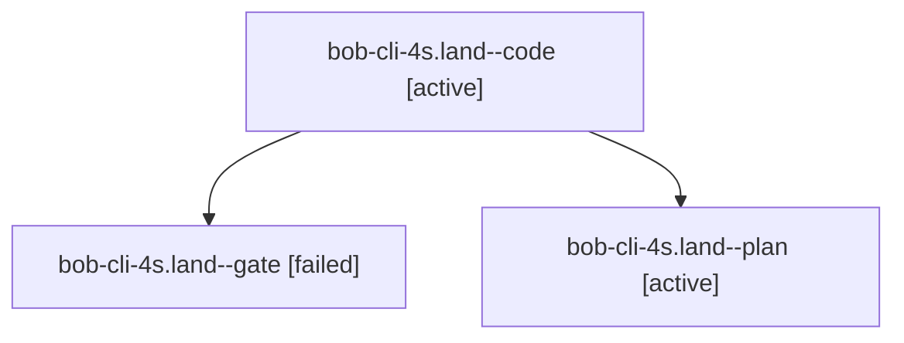

# Session: bob-cli-4s.land

[Agent Hoods](../README.md) / [bbugyi200](../users/bbugyi200/README.md) / [athena](../users/bbugyi200/machines/athena/README.md) / [bob-cli-4s](../users/bbugyi200/machines/athena/hoods/bob-cli-4s/README.md) / bob-cli-4s.land

Owner: `bbugyi200.athena` · Hood: `bob-cli-4s` · Members: 3 · Bead: [bob-cli-4s](https://github.com/bobs-org/bob-cli--beads/blob/main/pages/bob-cli-4s/README.md)

## Lineage

The diagram is an optional enhancement; the ordered table below contains the same lineage in accessible text.

| Role | Agent | State | Model / provider | Timing | Commits | Prompt | Chat |
|---|---|---|---|---|---:|---|---|
| code | bob-cli-4s.land--code | active | muse-spark-1.3-contributor / muse | 2026-10-06T23:26:01.867451+00:00 | [1](../agents/bbugyi200.athena.bob-cli-4s.land--code/README.md#commits) | — | — |
| gate | bob-cli-4s.land--gate | failed | opus / claude | 2026-10-06T23:24:18.558889+00:00 → 2026-10-06T23:25:30.067825+00:00 | 0 | — | [Chat](../agents/bbugyi200.athena.bob-cli-4s.land--gate/chat.md) |
| plan | bob-cli-4s.land--plan | active | opus / claude | 2026-10-06T22:55:54.221309+00:00 | 0 | [Prompt](../agents/bbugyi200.athena.bob-cli-4s.land--plan/prompt.md) | [Chat](../agents/bbugyi200.athena.bob-cli-4s.land--plan/chat.md) |

## Commits

| Role | Repo | Commit | Subject | Committed |
|---|---|---|---|---|
| code | bob-cli | [`f5e7c78`](https://github.com/bobs-org/bob-cli/commit/f5e7c782ba6e9663867c59dbbba4612315ff82c7) | feat(highlights): finish bob-cli-4s listen landing fixes | 2026-10-06 19:50:24 EDT |

## Neighbors

| Agent | Relation | State |
|---|---|---|
| [bob-cli-4s.1](../agents/bbugyi200.athena.bob-cli-4s.1/README.md) | bob-cli-4s hood | completed |
| [bob-cli-4s.2](../agents/bbugyi200.athena.bob-cli-4s.2/README.md) | bob-cli-4s hood | completed |
| [bob-cli-4s.3](../agents/bbugyi200.athena.bob-cli-4s.3/README.md) | bob-cli-4s hood | completed |
| [bob-cli-4s.4](../agents/bbugyi200.athena.bob-cli-4s.4/README.md) | bob-cli-4s hood | completed |
| [bob-cli-4s.5](../agents/bbugyi200.athena.bob-cli-4s.5/README.md) | bob-cli-4s hood | completed |
| [bob-cli-4s.6](bbugyi200.athena.bob-cli-4s.6.md) (session · 3) | bob-cli-4s hood | completed 2, failed 1 |
