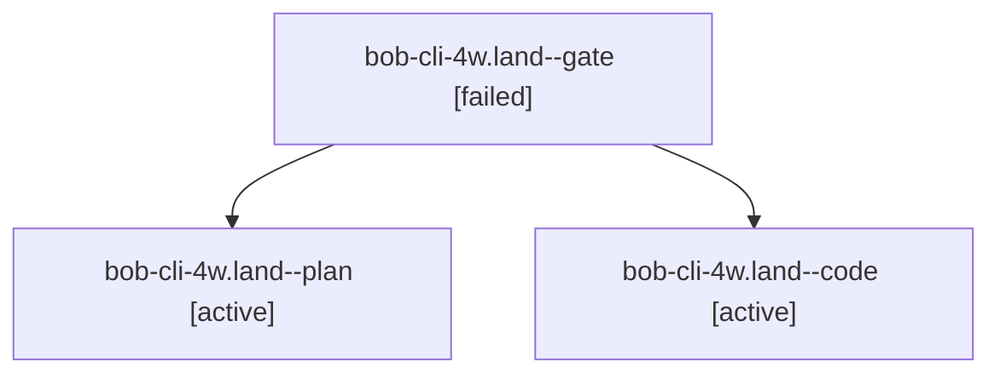

# Session: bob-cli-4w.land

[Agent Hoods](../README.md) / [bbugyi200](../users/bbugyi200/README.md) / [athena](../users/bbugyi200/machines/athena/README.md) / [bob-cli-4w](../users/bbugyi200/machines/athena/hoods/bob-cli-4w/README.md) / bob-cli-4w.land

Owner: `bbugyi200.athena` · Hood: `bob-cli-4w` · Members: 3 · Bead: [bob-cli-4w](https://github.com/bobs-org/bob-cli--beads/blob/main/pages/bob-cli-4w/README.md)

## Lineage

The diagram is an optional enhancement; the ordered table below contains the same lineage in accessible text.

| Role | Agent | State | Model / provider | Timing | Commits | Prompt | Chat |
|---|---|---|---|---|---:|---|---|
| gate | bob-cli-4w.land--gate | failed | opus / claude | 2026-10-07T04:41:11.308260+00:00 → 2026-10-07T04:41:37.845432+00:00 | 0 | — | [Chat](../agents/bbugyi200.athena.bob-cli-4w.land--gate/chat.md) |
| plan | bob-cli-4w.land--plan | active | opus / claude | 2026-10-07T04:00:17.796652+00:00 | 0 | [Prompt](../agents/bbugyi200.athena.bob-cli-4w.land--plan/prompt.md) | [Chat](../agents/bbugyi200.athena.bob-cli-4w.land--plan/chat.md) |
| code | bob-cli-4w.land--code | active | muse-spark-1.3-contributor / muse | 2026-10-07T04:41:52.623446+00:00 | [1](../agents/bbugyi200.athena.bob-cli-4w.land--code/README.md#commits) | — | — |

## Commits

| Role | Repo | Commit | Subject | Committed |
|---|---|---|---|---|
| code | bob-cli | [`6d2911c`](https://github.com/bobs-org/bob-cli/commit/6d2911ce416ad2898f5791ea2e602eb4c40aed54) | fix(ref): land bob-cli-4w with output, identity, hygiene, and docs fixes | 2026-10-07 01:12:05 EDT |

## Neighbors

| Agent | Relation | State |
|---|---|---|
| [bob-cli-4w.1](../agents/bbugyi200.athena.bob-cli-4w.1/README.md) | bob-cli-4w hood | completed |
| [bob-cli-4w.10](../agents/bbugyi200.athena.bob-cli-4w.10/README.md) | bob-cli-4w hood | completed |
| [bob-cli-4w.11](../agents/bbugyi200.athena.bob-cli-4w.11/README.md) | bob-cli-4w hood | completed |
| [bob-cli-4w.2](../agents/bbugyi200.athena.bob-cli-4w.2/README.md) | bob-cli-4w hood | completed |
| [bob-cli-4w.3](../agents/bbugyi200.athena.bob-cli-4w.3/README.md) | bob-cli-4w hood | completed |
| [bob-cli-4w.4](../agents/bbugyi200.athena.bob-cli-4w.4/README.md) | bob-cli-4w hood | completed |
| [bob-cli-4w.5](../agents/bbugyi200.athena.bob-cli-4w.5/README.md) | bob-cli-4w hood | completed |
| [bob-cli-4w.6](../agents/bbugyi200.athena.bob-cli-4w.6/README.md) | bob-cli-4w hood | completed |
| [bob-cli-4w.7](../agents/bbugyi200.athena.bob-cli-4w.7/README.md) | bob-cli-4w hood | completed |
| [bob-cli-4w.8](../agents/bbugyi200.athena.bob-cli-4w.8/README.md) | bob-cli-4w hood | completed |
| [bob-cli-4w.9](../agents/bbugyi200.athena.bob-cli-4w.9/README.md) | bob-cli-4w hood | completed |
