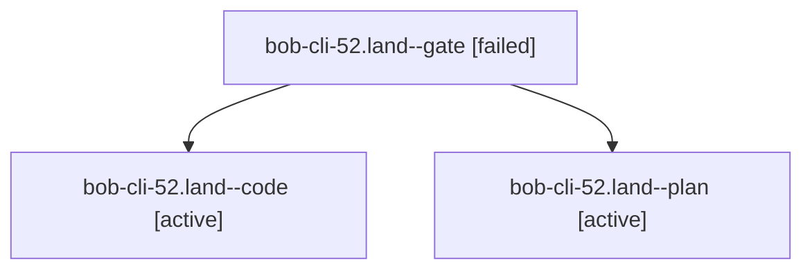

# Session: bob-cli-52.land

[Agent Hoods](../README.md) / [bbugyi200](../users/bbugyi200/README.md) / [athena](../users/bbugyi200/machines/athena/README.md) / [bob-cli-52](../users/bbugyi200/machines/athena/hoods/bob-cli-52/README.md) / bob-cli-52.land

Owner: `bbugyi200.athena` · Hood: `bob-cli-52` · Members: 3 · Bead: [bob-cli-52](https://github.com/bobs-org/bob-cli--beads/blob/main/pages/bob-cli-52/README.md)

## Lineage

The diagram is an optional enhancement; the ordered table below contains the same lineage in accessible text.

| Role | Agent | State | Model / provider | Timing | Commits | Prompt | Chat |
|---|---|---|---|---|---:|---|---|
| gate | bob-cli-52.land--gate | failed | opus / claude | 2026-10-07T16:19:29.625468+00:00 → 2026-10-07T16:20:03.793321+00:00 | 0 | — | [Chat](../agents/bbugyi200.athena.bob-cli-52.land--gate/chat.md) |
| code | bob-cli-52.land--code | active | muse-spark-1.3-contributor / muse | 2026-10-07T16:20:20.296179+00:00 | [1](../agents/bbugyi200.athena.bob-cli-52.land--code/README.md#commits) | — | — |
| plan | bob-cli-52.land--plan | active | opus / claude | 2026-10-07T15:51:28.573161+00:00 | 0 | [Prompt](../agents/bbugyi200.athena.bob-cli-52.land--plan/prompt.md) | [Chat](../agents/bbugyi200.athena.bob-cli-52.land--plan/chat.md) |

## Commits

| Role | Repo | Commit | Subject | Committed |
|---|---|---|---|---|
| code | bob-cli | [`6244ddd`](https://github.com/bobs-org/bob-cli/commit/6244dddd931982a598920cdc0fdc69a752c462c8) | feat(landing): implement bob-cli-52 landing per 202610/bob\_cli\_52\_landing.md | 2026-10-07 13:08:30 EDT |

## Neighbors

| Agent | Relation | State |
|---|---|---|
| [bob-cli-52.1](../agents/bbugyi200.athena.bob-cli-52.1/README.md) | bob-cli-52 hood | completed |
| [bob-cli-52.2](../agents/bbugyi200.athena.bob-cli-52.2/README.md) | bob-cli-52 hood | completed |
| [bob-cli-52.3](../agents/bbugyi200.athena.bob-cli-52.3/README.md) | bob-cli-52 hood | completed |
| [bob-cli-52.4](../agents/bbugyi200.athena.bob-cli-52.4/README.md) | bob-cli-52 hood | completed |
| [bob-cli-52.5](../agents/bbugyi200.athena.bob-cli-52.5/README.md) | bob-cli-52 hood | completed |
| [bob-cli-52.6](../agents/bbugyi200.athena.bob-cli-52.6/README.md) | bob-cli-52 hood | completed |
| [bob-cli-52.7](../agents/bbugyi200.athena.bob-cli-52.7/README.md) | bob-cli-52 hood | completed |
| [bob-cli-52.8](../agents/bbugyi200.athena.bob-cli-52.8/README.md) | bob-cli-52 hood | completed |
| [bob-cli-52.9](../agents/bbugyi200.athena.bob-cli-52.9/README.md) | bob-cli-52 hood | completed |
