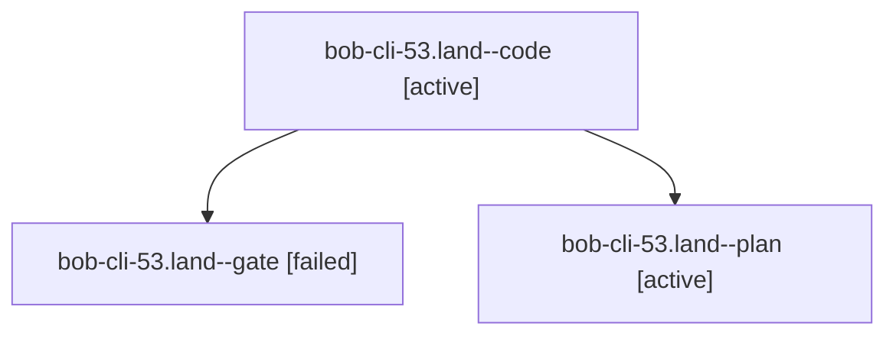

# Session: bob-cli-53.land

[Agent Hoods](../README.md) / [bbugyi200](../users/bbugyi200/README.md) / [athena](../users/bbugyi200/machines/athena/README.md) / [bob-cli-53](../users/bbugyi200/machines/athena/hoods/bob-cli-53/README.md) / bob-cli-53.land

Owner: `bbugyi200.athena` · Hood: `bob-cli-53` · Members: 3 · Bead: [bob-cli-53](https://github.com/bobs-org/bob-cli--beads/blob/main/pages/bob-cli-53/README.md)

## Lineage

The diagram is an optional enhancement; the ordered table below contains the same lineage in accessible text.

| Role | Agent | State | Model / provider | Timing | Commits | Prompt | Chat |
|---|---|---|---|---|---:|---|---|
| code | bob-cli-53.land--code | active | muse-spark-1.3-contributor / muse | 2026-10-07T13:28:08.769288+00:00 | 0 | — | — |
| gate | bob-cli-53.land--gate | failed | gpt-6.1-sol / codex | 2026-10-07T13:27:10.631547+00:00 → 2026-10-07T13:27:41.384811+00:00 | 0 | — | [Chat](../agents/bbugyi200.athena.bob-cli-53.land--gate/chat.md) |
| plan | bob-cli-53.land--plan | active | gpt-6.1-sol / codex | 2026-10-07T13:16:08.221281+00:00 | 0 | [Prompt](../agents/bbugyi200.athena.bob-cli-53.land--plan/prompt.md) | [Chat](../agents/bbugyi200.athena.bob-cli-53.land--plan/chat.md) |

## Neighbors

| Agent | Relation | State |
|---|---|---|
| [bob-cli-53.1](../agents/bbugyi200.athena.bob-cli-53.1/README.md) | bob-cli-53 hood | completed |
| [bob-cli-53.2](../agents/bbugyi200.athena.bob-cli-53.2/README.md) | bob-cli-53 hood | completed |
