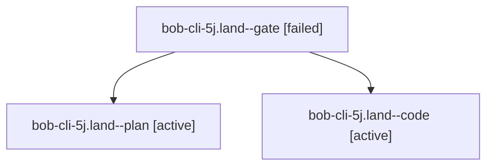

# Session: bob-cli-5j.land

[Agent Hoods](../README.md) / [bbugyi200](../users/bbugyi200/README.md) / [athena](../users/bbugyi200/machines/athena/README.md) / [bob-cli-5j](../users/bbugyi200/machines/athena/hoods/bob-cli-5j/README.md) / bob-cli-5j.land

Owner: `bbugyi200.athena` · Hood: `bob-cli-5j` · Members: 3 · Bead: [bob-cli-5j](https://github.com/bobs-org/bob-cli--beads/blob/main/pages/bob-cli-5j/README.md)

## Lineage

The diagram is an optional enhancement; the ordered table below contains the same lineage in accessible text.

| Role | Agent | State | Model / provider | Timing | Commits | Prompt | Chat |
|---|---|---|---|---|---:|---|---|
| gate | bob-cli-5j.land--gate | failed | gpt-6.1-sol / codex | 2026-10-07T20:31:26.497586+00:00 → 2026-10-07T20:32:36.308278+00:00 | 0 | — | [Chat](../agents/bbugyi200.athena.bob-cli-5j.land--gate/chat.md) |
| plan | bob-cli-5j.land--plan | active | gpt-6.1-sol / codex | 2026-10-07T20:10:28.446398+00:00 | 0 | [Prompt](../agents/bbugyi200.athena.bob-cli-5j.land--plan/prompt.md) | [Chat](../agents/bbugyi200.athena.bob-cli-5j.land--plan/chat.md) |
| code | bob-cli-5j.land--code | active | muse-spark-1.3-contributor / muse | 2026-10-07T20:32:45.450268+00:00 | [1](../agents/bbugyi200.athena.bob-cli-5j.land--code/README.md#commits) | — | — |

## Commits

| Role | Repo | Commit | Subject | Committed |
|---|---|---|---|---|
| code | bob-cli | [`39915c5`](https://github.com/bobs-org/bob-cli/commit/39915c5c96cf1d640bd0feae2cffd6d4a18911c1) | feat(highlights): finish paired return links and land bob-cli-5j | 2026-10-07 16:59:02 EDT |

## Neighbors

| Agent | Relation | State |
|---|---|---|
| [bob-cli-5j.1](../agents/bbugyi200.athena.bob-cli-5j.1/README.md) | bob-cli-5j hood | completed |
| [bob-cli-5j.2](../agents/bbugyi200.athena.bob-cli-5j.2/README.md) | bob-cli-5j hood | completed |
