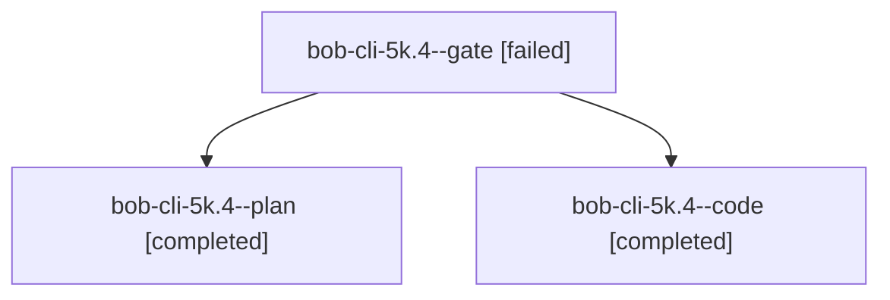

# Session: bob-cli-5k.4

[Agent Hoods](../README.md) / [bbugyi200](../users/bbugyi200/README.md) / [athena](../users/bbugyi200/machines/athena/README.md) / [bob-cli-5k](../users/bbugyi200/machines/athena/hoods/bob-cli-5k/README.md) / bob-cli-5k.4

Owner: `bbugyi200.athena` · Hood: `bob-cli-5k` · Members: 3 · Bead: [bob-cli-5k.4](https://github.com/bobs-org/bob-cli--beads/blob/main/pages/bob-cli-5k/bob-cli-5k.4.md)

## Lineage

The diagram is an optional enhancement; the ordered table below contains the same lineage in accessible text.

| Role | Agent | State | Model / provider | Timing | Commits | Prompt | Chat |
|---|---|---|---|---|---:|---|---|
| gate | bob-cli-5k.4--gate | failed | grok-4.7 / grok | 2026-10-07T19:07:48.054191+00:00 → 2026-10-07T19:09:05.822478+00:00 | 0 | — | [Chat](../agents/bbugyi200.athena.bob-cli-5k.4--gate/chat.md) |
| plan | bob-cli-5k.4--plan | completed | grok-4.7 / grok | 2026-10-07T18:51:35.476965+00:00 → 2026-10-07T19:38:10.617180+00:00 | 0 | [Prompt](../agents/bbugyi200.athena.bob-cli-5k.4--plan/prompt.md) | [Chat](../agents/bbugyi200.athena.bob-cli-5k.4--plan/chat.md) |
| code | bob-cli-5k.4--code | completed | muse-spark-1.3-contributor / muse | 2026-10-07T19:09:23.172039+00:00 → 2026-10-07T19:38:10.617180+00:00 | 0 | — | [Chat](../agents/bbugyi200.athena.bob-cli-5k.4--code/chat.md) |

## Neighbors

| Agent | Relation | State |
|---|---|---|
| [bob-cli-5k.1](../agents/bbugyi200.athena.bob-cli-5k.1/README.md) | bob-cli-5k hood | completed |
| [bob-cli-5k.2](../agents/bbugyi200.athena.bob-cli-5k.2/README.md) | bob-cli-5k hood | completed |
| [bob-cli-5k.3](../agents/bbugyi200.athena.bob-cli-5k.3/README.md) | bob-cli-5k hood | completed |
| [bob-cli-5k.5](bbugyi200.athena.bob-cli-5k.5.md) (session · 5) | bob-cli-5k hood | active 1, completed 2, failed 2 |
| [bob-cli-5k.6](../agents/bbugyi200.athena.bob-cli-5k.6/README.md) | bob-cli-5k hood | completed |
| [bob-cli-5k.7](bbugyi200.athena.bob-cli-5k.7.md) (session · 5) | bob-cli-5k hood | failed 5 |
| [bob-cli-5k.7.1.1](../agents/bbugyi200.athena.bob-cli-5k.7.1.1/README.md) | bob-cli-5k hood | active |
| [bob-cli-5k.7.1.2](../agents/bbugyi200.athena.bob-cli-5k.7.1.2/README.md) | bob-cli-5k hood | waiting |
| [bob-cli-5k.7.1.3](../agents/bbugyi200.athena.bob-cli-5k.7.1.3/README.md) | bob-cli-5k hood | waiting |
| [bob-cli-5k.7.1.4](../agents/bbugyi200.athena.bob-cli-5k.7.1.4/README.md) | bob-cli-5k hood | waiting |
| [bob-cli-5k.7.1.land](../agents/bbugyi200.athena.bob-cli-5k.7.1.land/README.md) | bob-cli-5k hood | waiting |
| [bob-cli-5k.land](../agents/bbugyi200.athena.bob-cli-5k.land/README.md) | bob-cli-5k hood | waiting |
