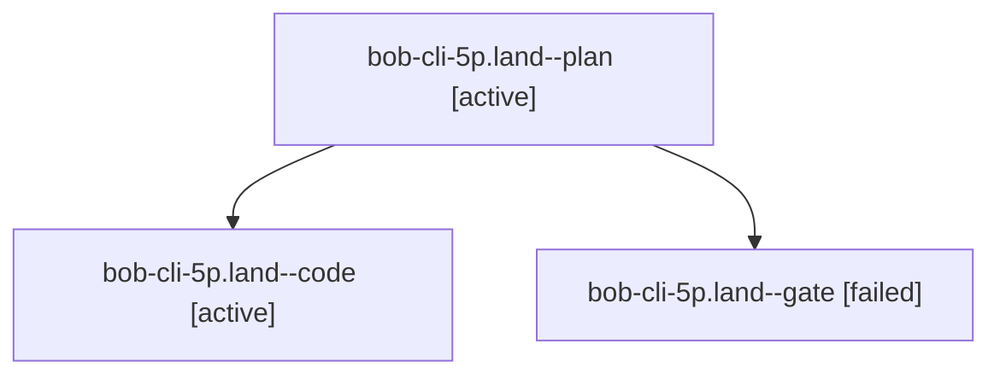

# Session: bob-cli-5p.land

[Agent Hoods](../README.md) / [bbugyi200](../users/bbugyi200/README.md) / [athena](../users/bbugyi200/machines/athena/README.md) / [bob-cli-5p](../users/bbugyi200/machines/athena/hoods/bob-cli-5p/README.md) / bob-cli-5p.land

Owner: `bbugyi200.athena` · Hood: `bob-cli-5p` · Members: 3 · Bead: [bob-cli-5p](https://github.com/bobs-org/bob-cli--beads/blob/main/pages/bob-cli-5p/README.md)

## Lineage



The diagram is an optional enhancement; the ordered table below contains the same lineage in accessible text.

| Role | Agent | State | Model / provider | Timing | Commits | Prompt | Chat |
|---|---|---|---|---|---:|---|---|
| <a id="member-plan"></a>plan | bob-cli-5p.land--plan | active | gpt-6.1-sol / codex | 2026-10-08T16:06:33.392406+00:00 | 0 | [Prompt](../agents/bbugyi200.athena.bob-cli-5p.land--plan/prompt.md) | [Chat](../agents/bbugyi200.athena.bob-cli-5p.land--plan/chat.md) |
| <a id="member-code"></a>code | bob-cli-5p.land--code | active | muse-spark-1.3-contributor / muse | 2026-10-08T16:24:00.220959+00:00 | 0 | — | — |
| <a id="member-gate"></a>gate | bob-cli-5p.land--gate | failed | gpt-6.1-sol / codex | 2026-10-08T16:23:21.676785+00:00 → 2026-10-08T16:23:44.544640+00:00 | 0 | — | [Chat](../agents/bbugyi200.athena.bob-cli-5p.land--gate/chat.md) |

## Variables

| Role | Variable | Value |
|---|---|---|
| plan | `artifacts` | \[{kind: file, label: bob-cli-5p landing reproduction of both unrelated roll-decay failures, path: /home/bryan/.sase/artifacts/agents/gh\_bobs-org\_\_bob-cli/20261008110602/bob-cli-5p-roll-decay-7ea3af01… |

#### artifacts

**Role:** `plan`

```yaml
- kind: file
  label: bob-cli-5p landing reproduction of both unrelated roll-decay failures
  path: /home/bryan/.sase/artifacts/agents/gh_bobs-org__bob-cli/20261008110602/bob-cli-5p-roll-decay-7ea3af01607d.log
  ref: file:explicit:d973ed74834aac4768839e70
  source_path: /tmp/bob-cli-5p-roll-decay.log
```

Values are truncated for display; see each member's agent meta.json for the full values.

## Neighbors

| Agent | Relation | State |
|---|---|---|
| [bob-cli-5p.1](../agents/bbugyi200.athena.bob-cli-5p.1/README.md) | bob-cli-5p hood | completed |
| [bob-cli-5p.2](../agents/bbugyi200.athena.bob-cli-5p.2/README.md) | bob-cli-5p hood | completed |
| [bob-cli-5p.3](../agents/bbugyi200.athena.bob-cli-5p.3/README.md) | bob-cli-5p hood | completed |
| [bob-cli-5p.4](../agents/bbugyi200.athena.bob-cli-5p.4/README.md) | bob-cli-5p hood | completed |
