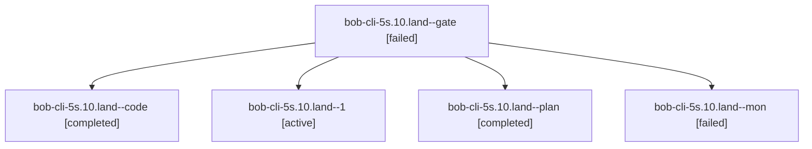

# Session: bob-cli-5s.10.land

[Agent Hoods](../README.md) / [bbugyi200](../users/bbugyi200/README.md) / [athena](../users/bbugyi200/machines/athena/README.md) / [bob-cli-5s](../users/bbugyi200/machines/athena/hoods/bob-cli-5s/README.md) / bob-cli-5s.10.land

Owner: `bbugyi200.athena` · Hood: `bob-cli-5s` · Members: 5 · Bead: [bob-cli-5s.10](https://github.com/bobs-org/bob-cli--beads/blob/main/pages/bob-cli-5s/bob-cli-5s.10.md)

## Lineage

The diagram is an optional enhancement; the ordered table below contains the same lineage in accessible text.

| Role | Agent | State | Model / provider | Timing | Commits | Prompt | Chat |
|---|---|---|---|---|---:|---|---|
| gate | bob-cli-5s.10.land--gate | failed | grok-4.7 / grok | 2026-10-09T15:54:37.931278+00:00 → 2026-10-09T15:55:46.042491+00:00 | 0 | — | [Chat](../agents/bbugyi200.athena.bob-cli-5s.10.land--gate/chat.md) |
| code | bob-cli-5s.10.land--code | completed | muse-spark-1.3-contributor / muse | 2026-10-09T15:56:01.972739+00:00 → 2026-10-09T16:10:24.301844+00:00 | 0 | — | [Chat](../agents/bbugyi200.athena.bob-cli-5s.10.land--code/chat.md) |
| 1 | bob-cli-5s.10.land--1 | active | muse-spark-1.3-contributor / muse | 2026-10-09T16:14:47.571930+00:00 | 0 | [Prompt](../agents/bbugyi200.athena.bob-cli-5s.10.land--1/prompt.md) | — |
| plan | bob-cli-5s.10.land--plan | completed | grok-4.7 / grok | 2026-10-09T15:42:19.670013+00:00 → 2026-10-09T16:10:24.301844+00:00 | 0 | [Prompt](../agents/bbugyi200.athena.bob-cli-5s.10.land--plan/prompt.md) | [Chat](../agents/bbugyi200.athena.bob-cli-5s.10.land--plan/chat.md) |
| mon | bob-cli-5s.10.land--mon | failed | muse-spark-1.3-contributor / muse | 2026-10-09T16:09:16.861296+00:00 → 2026-10-09T16:13:34.069621+00:00 | 0 | — | [Chat](../agents/bbugyi200.athena.bob-cli-5s.10.land--mon/chat.md) |

## Neighbors

| Agent | Relation | State |
|---|---|---|
| [bob-cli-5s.10.3](../agents/bbugyi200.athena.bob-cli-5s.10.3/README.md) | bob-cli-5s.10 hood | completed |
| [bob-cli-5s.10.4](../agents/bbugyi200.athena.bob-cli-5s.10.4/README.md) | bob-cli-5s.10 hood | completed |
