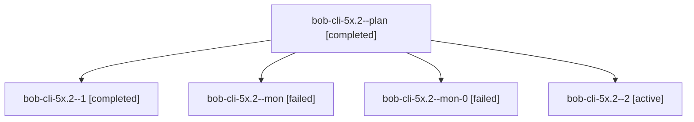

# Session: bob-cli-5x.2

[Agent Hoods](../README.md) / [bbugyi200](../users/bbugyi200/README.md) / [athena](../users/bbugyi200/machines/athena/README.md) / [bob-cli-5x](../users/bbugyi200/machines/athena/hoods/bob-cli-5x/README.md) / bob-cli-5x.2

Owner: `bbugyi200.athena` · Hood: `bob-cli-5x` · Members: 5 · Bead: [bob-cli-5x.2](https://github.com/bobs-org/bob-cli--beads/blob/main/pages/bob-cli-5x/bob-cli-5x.2.md)

## Lineage

The diagram is an optional enhancement; the ordered table below contains the same lineage in accessible text.

| Role | Agent | State | Model / provider | Timing | Commits | Prompt | Chat |
|---|---|---|---|---|---:|---|---|
| plan | bob-cli-5x.2--plan | completed | muse-spark-1.3-contributor / muse | 2026-10-09T16:29:36.495329+00:00 → 2026-10-09T16:50:47.028320+00:00 | 0 | [Prompt](../agents/bbugyi200.athena.bob-cli-5x.2--plan/prompt.md) | [Chat](../agents/bbugyi200.athena.bob-cli-5x.2--plan/chat.md) |
| 1 | bob-cli-5x.2--1 | completed | muse-spark-1.3-contributor / muse | 2026-10-09T16:55:49.780731+00:00 → 2026-10-09T16:58:37.722129+00:00 | 0 | [Prompt](../agents/bbugyi200.athena.bob-cli-5x.2--1/prompt.md) | [Chat](../agents/bbugyi200.athena.bob-cli-5x.2--1/chat.md) |
| mon | bob-cli-5x.2--mon | failed | muse-spark-1.3-contributor / muse | 2026-10-09T16:48:35.287329+00:00 → 2026-10-09T16:51:52.927787+00:00 | 0 | — | [Chat](../agents/bbugyi200.athena.bob-cli-5x.2--mon/chat.md) |
| mon-0 | bob-cli-5x.2--mon-0 | failed | muse-spark-1.3-contributor / muse | 2026-10-09T16:57:50.509884+00:00 → 2026-10-09T17:02:33.232397+00:00 | 0 | — | [Chat](../agents/bbugyi200.athena.bob-cli-5x.2--mon-0/chat.md) |
| 2 | bob-cli-5x.2--2 | active | muse-spark-1.3-contributor / muse | 2026-10-09T17:03:07.499404+00:00 | 0 | [Prompt](../agents/bbugyi200.athena.bob-cli-5x.2--2/prompt.md) | — |

## Neighbors

| Agent | Relation | State |
|---|---|---|
| [bob-cli-5x.1](../agents/bbugyi200.athena.bob-cli-5x.1/README.md) | bob-cli-5x hood | completed |
| [bob-cli-5x.3](../agents/bbugyi200.athena.bob-cli-5x.3/README.md) | bob-cli-5x hood | waiting |
| [bob-cli-5x.4](../agents/bbugyi200.athena.bob-cli-5x.4/README.md) | bob-cli-5x hood | waiting |
| [bob-cli-5x.land](../agents/bbugyi200.athena.bob-cli-5x.land/README.md) | bob-cli-5x hood | waiting |
