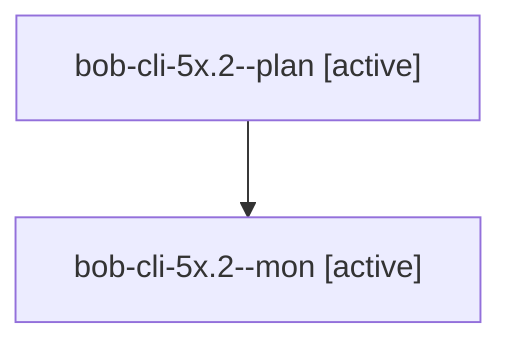

# Session: bob-cli-5x.2

[Agent Hoods](../README.md) / [bbugyi200](../users/bbugyi200/README.md) / [athena](../users/bbugyi200/machines/athena/README.md) / [bob-cli-5x](../users/bbugyi200/machines/athena/hoods/bob-cli-5x/README.md) / bob-cli-5x.2

Owner: `bbugyi200.athena` · Hood: `bob-cli-5x` · Members: 2 · Bead: [bob-cli-5x.2](https://github.com/bobs-org/bob-cli--beads/blob/main/pages/bob-cli-5x/bob-cli-5x.2.md)

## Lineage

The diagram is an optional enhancement; the ordered table below contains the same lineage in accessible text.

| Role | Agent | State | Model / provider | Timing | Commits | Prompt | Chat |
|---|---|---|---|---|---:|---|---|
| plan | bob-cli-5x.2--plan | active | muse-spark-1.3-contributor / muse | 2026-10-09T16:29:36.495329+00:00 | 0 | [Prompt](../agents/bbugyi200.athena.bob-cli-5x.2--plan/prompt.md) | [Chat](../agents/bbugyi200.athena.bob-cli-5x.2--plan/chat.md) |
| mon | bob-cli-5x.2--mon | active | muse-spark-1.3-contributor / muse | 2026-10-09T16:48:35.287329+00:00 | 0 | — | — |

## Neighbors

| Agent | Relation | State |
|---|---|---|
| [bob-cli-5x.1](../agents/bbugyi200.athena.bob-cli-5x.1/README.md) | bob-cli-5x hood | active |
| [bob-cli-5x.3](../agents/bbugyi200.athena.bob-cli-5x.3/README.md) | bob-cli-5x hood | waiting |
| [bob-cli-5x.4](../agents/bbugyi200.athena.bob-cli-5x.4/README.md) | bob-cli-5x hood | waiting |
| [bob-cli-5x.land](../agents/bbugyi200.athena.bob-cli-5x.land/README.md) | bob-cli-5x hood | waiting |
