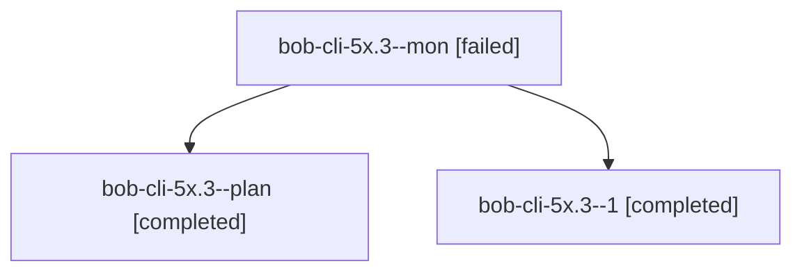

# Session: bob-cli-5x.3

[Agent Hoods](../README.md) / [bbugyi200](../users/bbugyi200/README.md) / [athena](../users/bbugyi200/machines/athena/README.md) / [bob-cli-5x](../users/bbugyi200/machines/athena/hoods/bob-cli-5x/README.md) / bob-cli-5x.3

Owner: `bbugyi200.athena` · Hood: `bob-cli-5x` · Members: 3 · Bead: [bob-cli-5x.3](https://github.com/bobs-org/bob-cli--beads/blob/main/pages/bob-cli-5x/bob-cli-5x.3.md)

## Lineage

The diagram is an optional enhancement; the ordered table below contains the same lineage in accessible text.

| Role | Agent | State | Model / provider | Timing | Commits | Prompt | Chat |
|---|---|---|---|---|---:|---|---|
| mon | bob-cli-5x.3--mon | failed | muse-spark-1.3-contributor / muse | 2026-10-09T17:43:18.943650+00:00 → 2026-10-09T17:48:58.621647+00:00 | 0 | — | [Chat](../agents/bbugyi200.athena.bob-cli-5x.3--mon/chat.md) |
| plan | bob-cli-5x.3--plan | completed | muse-spark-1.3-contributor / muse | 2026-10-09T17:27:06.149118+00:00 → 2026-10-09T17:47:01.112166+00:00 | 0 | [Prompt](../agents/bbugyi200.athena.bob-cli-5x.3--plan/prompt.md) | [Chat](../agents/bbugyi200.athena.bob-cli-5x.3--plan/chat.md) |
| 1 | bob-cli-5x.3--1 | completed | muse-spark-1.3-contributor / muse | 2026-10-09T17:53:02.267702+00:00 → 2026-10-09T17:59:30.827509+00:00 | 0 | [Prompt](../agents/bbugyi200.athena.bob-cli-5x.3--1/prompt.md) | [Chat](../agents/bbugyi200.athena.bob-cli-5x.3--1/chat.md) |

## Neighbors

| Agent | Relation | State |
|---|---|---|
| [bob-cli-5x.1](../agents/bbugyi200.athena.bob-cli-5x.1/README.md) | bob-cli-5x hood | completed |
| [bob-cli-5x.2](bbugyi200.athena.bob-cli-5x.2.md) (session · 7) | bob-cli-5x hood | completed 4, failed 3 |
| [bob-cli-5x.4](bbugyi200.athena.bob-cli-5x.4.md) (session · 3) | bob-cli-5x hood | completed 2, failed 1 |
| [bob-cli-5x.land](bbugyi200.athena.bob-cli-5x.land.md) (session · 4) | bob-cli-5x hood | active 1, completed 2, failed 1 |
