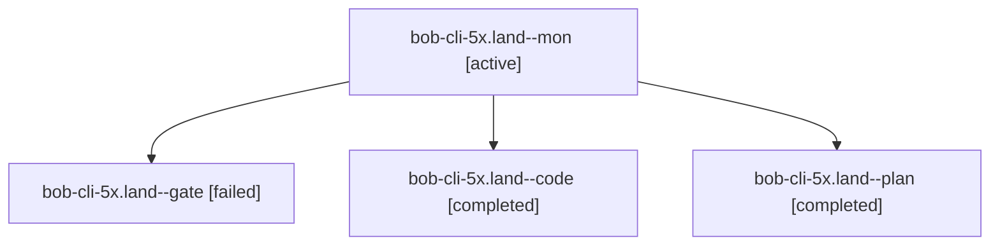

# Session: bob-cli-5x.land

[Agent Hoods](../README.md) / [bbugyi200](../users/bbugyi200/README.md) / [athena](../users/bbugyi200/machines/athena/README.md) / [bob-cli-5x](../users/bbugyi200/machines/athena/hoods/bob-cli-5x/README.md) / bob-cli-5x.land

Owner: `bbugyi200.athena` · Hood: `bob-cli-5x` · Members: 4 · Bead: [bob-cli-5x](https://github.com/bobs-org/bob-cli--beads/blob/main/pages/bob-cli-5x/README.md)

## Lineage



The diagram is an optional enhancement; the ordered table below contains the same lineage in accessible text.

| Role | Agent | State | Model / provider | Timing | Commits | Prompt | Chat |
|---|---|---|---|---|---:|---|---|
| <a id="member-mon"></a>mon | bob-cli-5x.land--mon | active | muse-spark-1.3-contributor / muse | 2026-10-09T18:54:38.016961+00:00 | 0 | — | — |
| <a id="member-gate"></a>gate | bob-cli-5x.land--gate | failed | gpt-6.1-sol / codex | 2026-10-09T18:46:26.382096+00:00 → 2026-10-09T18:47:10.529861+00:00 | 0 | — | [Chat](../agents/bbugyi200.athena.bob-cli-5x.land--gate/chat.md) |
| <a id="member-code"></a>code | bob-cli-5x.land--code | completed | muse-spark-1.3-contributor / muse | 2026-10-09T18:47:27.825235+00:00 → 2026-10-09T18:56:14.042427+00:00 | 0 | — | [Chat](../agents/bbugyi200.athena.bob-cli-5x.land--code/chat.md) |
| <a id="member-plan"></a>plan | bob-cli-5x.land--plan | completed | gpt-6.1-sol / codex | 2026-10-09T18:33:23.945950+00:00 → 2026-10-09T18:56:14.042427+00:00 | 0 | [Prompt](../agents/bbugyi200.athena.bob-cli-5x.land--plan/prompt.md) | [Chat](../agents/bbugyi200.athena.bob-cli-5x.land--plan/chat.md) |

## Variables

| Role | Variable | Value |
|---|---|---|
| plan | `artifacts` | \[{bead: bob-cli-5x, kind: file, label: bob-cli-5x.4 proposed Refs refresh-order timeout: CI fail and pass evidence, path: /home/bryan/.sase/artifacts/agents/gh\_bobs-org\_\_bob-cli/20261009122746/bob-cl… |

#### artifacts

**Role:** `plan`

```yaml
- bead: bob-cli-5x
  kind: file
  label: bob-cli-5x.4 proposed Refs refresh-order timeout: CI fail and pass evidence
  path: /home/bryan/.sase/artifacts/agents/gh_bobs-org__bob-cli/20261009122746/bob-cli-5x-refresh-timeout-evidence-7bd6ce98e5f9.txt
  ref: file:explicit:c6560e48933887da529d30d2
  source_path: /tmp/bob-cli-5x-refresh-timeout-evidence.txt
- bead: bob-cli-5x
  kind: file
  label: bob-cli-5x landing reproduction: scan intake incorrectly reports a standalone audio move
  path: /home/bryan/.sase/artifacts/agents/gh_bobs-org__bob-cli/20261009122746/bob-cli-5x-intake-repro-d687d0a6a6e0.json
  ref: file:explicit:1d014ee19d2c86caa490cd53
  source_path: /tmp/bob-cli-5x-intake-repro.json
```

Values are truncated for display; see each member's agent meta.json for the full values.

## Neighbors

| Agent | Relation | State |
|---|---|---|
| [bob-cli-5x.1](../agents/bbugyi200.athena.bob-cli-5x.1/README.md) | bob-cli-5x hood | completed |
| [bob-cli-5x.2](bbugyi200.athena.bob-cli-5x.2.md) (session · 7) | bob-cli-5x hood | completed 4, failed 3 |
| [bob-cli-5x.3](bbugyi200.athena.bob-cli-5x.3.md) (session · 3) | bob-cli-5x hood | completed 2, failed 1 |
| [bob-cli-5x.4](bbugyi200.athena.bob-cli-5x.4.md) (session · 3) | bob-cli-5x hood | completed 2, failed 1 |
