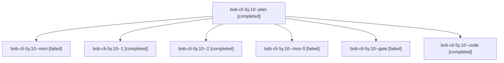

# Session: bob-cli-5y.10

[Agent Hoods](../README.md) / [bbugyi200](../users/bbugyi200/README.md) / [athena](../users/bbugyi200/machines/athena/README.md) / [bob-cli-5y](../users/bbugyi200/machines/athena/hoods/bob-cli-5y/README.md) / bob-cli-5y.10

Owner: `bbugyi200.athena` · Hood: `bob-cli-5y` · Members: 7 · Bead: [bob-cli-5y.10](https://github.com/bobs-org/bob-cli--beads/blob/main/pages/bob-cli-5y/bob-cli-5y.10.md)

## Lineage

The diagram is an optional enhancement; the ordered table below contains the same lineage in accessible text.

| Role | Agent | State | Model / provider | Timing | Commits | Prompt | Chat |
|---|---|---|---|---|---:|---|---|
| plan | bob-cli-5y.10--plan | completed | gpt-6.1-sol / codex | 2026-10-09T23:49:29.387982+00:00 → 2026-10-10T00:39:02.810052+00:00 | 0 | [Prompt](../agents/bbugyi200.athena.bob-cli-5y.10--plan/prompt.md) | [Chat](../agents/bbugyi200.athena.bob-cli-5y.10--plan/chat.md) |
| mon | bob-cli-5y.10--mon | failed | muse-spark-1.3-contributor / muse | 2026-10-10T00:36:05.588700+00:00 → 2026-10-10T00:40:34.907794+00:00 | 0 | — | [Chat](../agents/bbugyi200.athena.bob-cli-5y.10--mon/chat.md) |
| 1 | bob-cli-5y.10--1 | completed | muse-spark-1.3-contributor / muse | 2026-10-10T00:41:59.702634+00:00 → 2026-10-10T01:01:56.925826+00:00 | 0 | [Prompt](../agents/bbugyi200.athena.bob-cli-5y.10--1/prompt.md) | [Chat](../agents/bbugyi200.athena.bob-cli-5y.10--1/chat.md) |
| 2 | bob-cli-5y.10--2 | completed | muse-spark-1.3-contributor / muse | 2026-10-10T01:04:29.389887+00:00 → 2026-10-10T01:08:19.439064+00:00 | [1](../agents/bbugyi200.athena.bob-cli-5y.10--2/README.md#commits) | [Prompt](../agents/bbugyi200.athena.bob-cli-5y.10--2/prompt.md) | [Chat](../agents/bbugyi200.athena.bob-cli-5y.10--2/chat.md) |
| mon-0 | bob-cli-5y.10--mon-0 | failed | muse-spark-1.3-contributor / muse | 2026-10-10T01:01:23.639218+00:00 → 2026-10-10T01:03:28.283164+00:00 | 0 | — | [Chat](../agents/bbugyi200.athena.bob-cli-5y.10--mon-0/chat.md) |
| gate | bob-cli-5y.10--gate | failed | gpt-6.1-sol / codex | 2026-10-09T23:53:32.302018+00:00 → 2026-10-09T23:54:16.788407+00:00 | 0 | — | [Chat](../agents/bbugyi200.athena.bob-cli-5y.10--gate/chat.md) |
| code | bob-cli-5y.10--code | completed | muse-spark-1.3-contributor / muse | 2026-10-09T23:54:24.161076+00:00 → 2026-10-10T00:39:02.810052+00:00 | 0 | — | [Chat](../agents/bbugyi200.athena.bob-cli-5y.10--code/chat.md) |

## Commits

| Role | Repo | Commit | Subject | Committed |
|---|---|---|---|---|
| 2 | bob-cli | [`091eda9`](https://github.com/bobs-org/bob-cli/commit/091eda911b985e0c69e5d20982c9d7275fd61b2e) | feat(capture-gkeep): URL @route and gkeep pull choose the reference parent | 2026-10-09 21:07:04 EDT |

## Neighbors

| Agent | Relation | State |
|---|---|---|
| [bob-cli-5y.1](../agents/bbugyi200.athena.bob-cli-5y.1/README.md) | bob-cli-5y hood | completed |
| [bob-cli-5y.11](bbugyi200.athena.bob-cli-5y.11.md) (session · 3) | bob-cli-5y hood | completed 2, failed 1 |
| [bob-cli-5y.12](bbugyi200.athena.bob-cli-5y.12.md) (session · 3) | bob-cli-5y hood | active 1, completed 1, failed 1 |
| [bob-cli-5y.13](../agents/bbugyi200.athena.bob-cli-5y.13/README.md) | bob-cli-5y hood | completed |
| [bob-cli-5y.14](../agents/bbugyi200.athena.bob-cli-5y.14/README.md) | bob-cli-5y hood | waiting |
| [bob-cli-5y.2](../agents/bbugyi200.athena.bob-cli-5y.2/README.md) | bob-cli-5y hood | completed |
| [bob-cli-5y.3](../agents/bbugyi200.athena.bob-cli-5y.3/README.md) | bob-cli-5y hood | completed |
| [bob-cli-5y.4](../agents/bbugyi200.athena.bob-cli-5y.4/README.md) | bob-cli-5y hood | completed |
| [bob-cli-5y.5](../agents/bbugyi200.athena.bob-cli-5y.5/README.md) | bob-cli-5y hood | active |
| [bob-cli-5y.6](../agents/bbugyi200.athena.bob-cli-5y.6/README.md) | bob-cli-5y hood | completed |
| [bob-cli-5y.7](bbugyi200.athena.bob-cli-5y.7.md) (session · 3) | bob-cli-5y hood | completed 2, failed 1 |
| [bob-cli-5y.8](../agents/bbugyi200.athena.bob-cli-5y.8/README.md) | bob-cli-5y hood | completed |
| [bob-cli-5y.9](../agents/bbugyi200.athena.bob-cli-5y.9/README.md) | bob-cli-5y hood | completed |
| [bob-cli-5y.land](../agents/bbugyi200.athena.bob-cli-5y.land/README.md) | bob-cli-5y hood | waiting |
