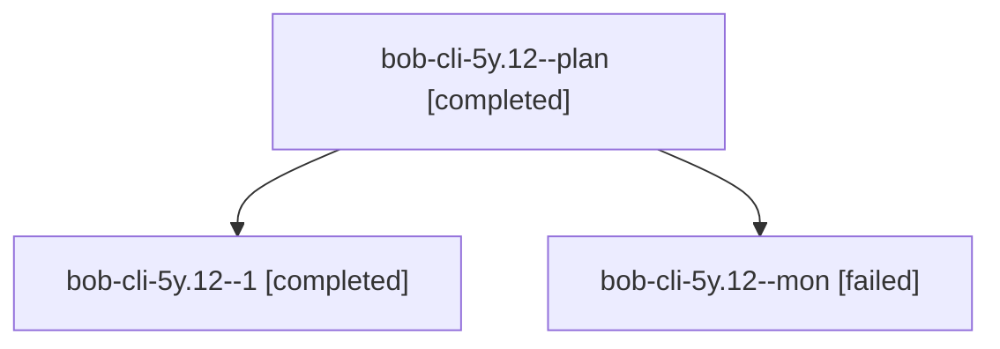

# Session: bob-cli-5y.12

[Agent Hoods](../README.md) / [bbugyi200](../users/bbugyi200/README.md) / [athena](../users/bbugyi200/machines/athena/README.md) / [bob-cli-5y](../users/bbugyi200/machines/athena/hoods/bob-cli-5y/README.md) / bob-cli-5y.12

Owner: `bbugyi200.athena` · Hood: `bob-cli-5y` · Members: 3 · Bead: [bob-cli-5y.12](https://github.com/bobs-org/bob-cli--beads/blob/main/pages/bob-cli-5y/bob-cli-5y.12.md)

## Lineage

The diagram is an optional enhancement; the ordered table below contains the same lineage in accessible text.

| Role | Agent | State | Model / provider | Timing | Commits | Prompt | Chat |
|---|---|---|---|---|---:|---|---|
| plan | bob-cli-5y.12--plan | completed | muse-spark-1.3-contributor / muse | 2026-10-10T01:09:18.621994+00:00 → 2026-10-10T01:48:35.312198+00:00 | 0 | [Prompt](../agents/bbugyi200.athena.bob-cli-5y.12--plan/prompt.md) | [Chat](../agents/bbugyi200.athena.bob-cli-5y.12--plan/chat.md) |
| 1 | bob-cli-5y.12--1 | completed | muse-spark-1.3-contributor / muse | 2026-10-10T01:52:50.044540+00:00 → 2026-10-10T02:00:47.389937+00:00 | 0 | [Prompt](../agents/bbugyi200.athena.bob-cli-5y.12--1/prompt.md) | [Chat](../agents/bbugyi200.athena.bob-cli-5y.12--1/chat.md) |
| mon | bob-cli-5y.12--mon | failed | muse-spark-1.3-contributor / muse | 2026-10-10T01:48:06.483162+00:00 → 2026-10-10T01:51:33.188158+00:00 | 0 | — | [Chat](../agents/bbugyi200.athena.bob-cli-5y.12--mon/chat.md) |

## Neighbors

| Agent | Relation | State |
|---|---|---|
| [bob-cli-5y.1](../agents/bbugyi200.athena.bob-cli-5y.1/README.md) | bob-cli-5y hood | completed |
| [bob-cli-5y.10](bbugyi200.athena.bob-cli-5y.10.md) (session · 7) | bob-cli-5y hood | completed 4, failed 3 |
| [bob-cli-5y.11](bbugyi200.athena.bob-cli-5y.11.md) (session · 3) | bob-cli-5y hood | completed 2, failed 1 |
| [bob-cli-5y.13](../agents/bbugyi200.athena.bob-cli-5y.13/README.md) | bob-cli-5y hood | completed |
| [bob-cli-5y.14](../agents/bbugyi200.athena.bob-cli-5y.14/README.md) | bob-cli-5y hood | active |
| [bob-cli-5y.2](../agents/bbugyi200.athena.bob-cli-5y.2/README.md) | bob-cli-5y hood | completed |
| [bob-cli-5y.3](../agents/bbugyi200.athena.bob-cli-5y.3/README.md) | bob-cli-5y hood | completed |
| [bob-cli-5y.4](../agents/bbugyi200.athena.bob-cli-5y.4/README.md) | bob-cli-5y hood | completed |
| [bob-cli-5y.5](../agents/bbugyi200.athena.bob-cli-5y.5/README.md) | bob-cli-5y hood | active |
| [bob-cli-5y.6](../agents/bbugyi200.athena.bob-cli-5y.6/README.md) | bob-cli-5y hood | completed |
| [bob-cli-5y.7](bbugyi200.athena.bob-cli-5y.7.md) (session · 3) | bob-cli-5y hood | completed 2, failed 1 |
| [bob-cli-5y.8](../agents/bbugyi200.athena.bob-cli-5y.8/README.md) | bob-cli-5y hood | completed |
| [bob-cli-5y.9](../agents/bbugyi200.athena.bob-cli-5y.9/README.md) | bob-cli-5y hood | completed |
| [bob-cli-5y.land](../agents/bbugyi200.athena.bob-cli-5y.land/README.md) | bob-cli-5y hood | waiting |
