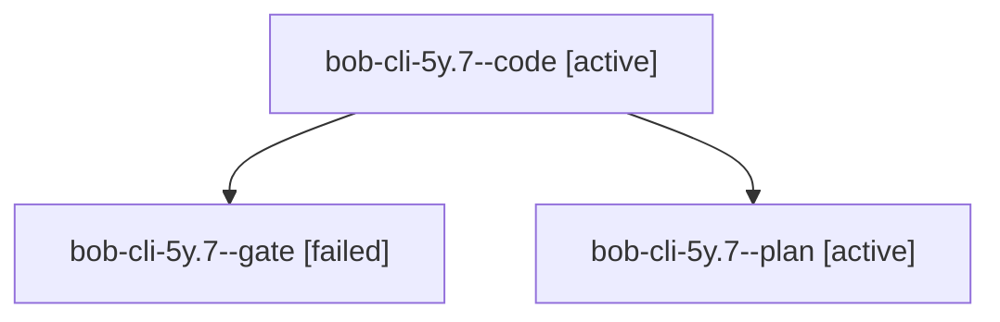

# Session: bob-cli-5y.7

[Agent Hoods](../README.md) / [bbugyi200](../users/bbugyi200/README.md) / [athena](../users/bbugyi200/machines/athena/README.md) / [bob-cli-5y](../users/bbugyi200/machines/athena/hoods/bob-cli-5y/README.md) / bob-cli-5y.7

Owner: `bbugyi200.athena` · Hood: `bob-cli-5y` · Members: 3 · Bead: [bob-cli-5y.7](https://github.com/bobs-org/bob-cli--beads/blob/main/pages/bob-cli-5y/bob-cli-5y.7.md)

## Lineage

The diagram is an optional enhancement; the ordered table below contains the same lineage in accessible text.

| Role | Agent | State | Model / provider | Timing | Commits | Prompt | Chat |
|---|---|---|---|---|---:|---|---|
| code | bob-cli-5y.7--code | active | muse-spark-1.3-contributor / muse | 2026-10-09T19:06:48.691947+00:00 | [1](../agents/bbugyi200.athena.bob-cli-5y.7--code/README.md#commits) | — | — |
| gate | bob-cli-5y.7--gate | failed | gpt-6.1-sol / codex | 2026-10-09T19:05:15.589787+00:00 → 2026-10-09T19:06:41.194554+00:00 | 0 | — | [Chat](../agents/bbugyi200.athena.bob-cli-5y.7--gate/chat.md) |
| plan | bob-cli-5y.7--plan | active | gpt-6.1-sol / codex | 2026-10-09T18:57:51.211329+00:00 | 0 | [Prompt](../agents/bbugyi200.athena.bob-cli-5y.7--plan/prompt.md) | [Chat](../agents/bbugyi200.athena.bob-cli-5y.7--plan/chat.md) |

## Commits

| Role | Repo | Commit | Subject | Committed |
|---|---|---|---|---|
| code | bob-cli | [`4016229`](https://github.com/bobs-org/bob-cli/commit/40162297a54caf743a177d85266a41e8bfe1a838) | feat(ref-tasks): add shared v2 reading-task rendering and guarded insertion | 2026-10-09 15:19:22 EDT |

## Neighbors

| Agent | Relation | State |
|---|---|---|
| [bob-cli-5y.1](../agents/bbugyi200.athena.bob-cli-5y.1/README.md) | bob-cli-5y hood | completed |
| [bob-cli-5y.10](../agents/bbugyi200.athena.bob-cli-5y.10/README.md) | bob-cli-5y hood | waiting |
| [bob-cli-5y.11](../agents/bbugyi200.athena.bob-cli-5y.11/README.md) | bob-cli-5y hood | waiting |
| [bob-cli-5y.12](../agents/bbugyi200.athena.bob-cli-5y.12/README.md) | bob-cli-5y hood | waiting |
| [bob-cli-5y.13](../agents/bbugyi200.athena.bob-cli-5y.13/README.md) | bob-cli-5y hood | waiting |
| [bob-cli-5y.14](../agents/bbugyi200.athena.bob-cli-5y.14/README.md) | bob-cli-5y hood | waiting |
| [bob-cli-5y.2](../agents/bbugyi200.athena.bob-cli-5y.2/README.md) | bob-cli-5y hood | completed |
| [bob-cli-5y.3](../agents/bbugyi200.athena.bob-cli-5y.3/README.md) | bob-cli-5y hood | completed |
| [bob-cli-5y.4](../agents/bbugyi200.athena.bob-cli-5y.4/README.md) | bob-cli-5y hood | completed |
| [bob-cli-5y.5](../agents/bbugyi200.athena.bob-cli-5y.5/README.md) | bob-cli-5y hood | active |
| [bob-cli-5y.6](../agents/bbugyi200.athena.bob-cli-5y.6/README.md) | bob-cli-5y hood | completed |
| [bob-cli-5y.8](../agents/bbugyi200.athena.bob-cli-5y.8/README.md) | bob-cli-5y hood | active |
| [bob-cli-5y.9](../agents/bbugyi200.athena.bob-cli-5y.9/README.md) | bob-cli-5y hood | waiting |
| [bob-cli-5y.land](../agents/bbugyi200.athena.bob-cli-5y.land/README.md) | bob-cli-5y hood | waiting |
