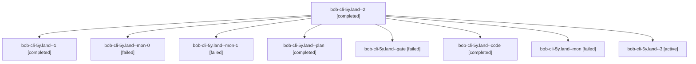

# Session: bob-cli-5y.land

[Agent Hoods](../README.md) / [bbugyi200](../users/bbugyi200/README.md) / [athena](../users/bbugyi200/machines/athena/README.md) / [bob-cli-5y](../users/bbugyi200/machines/athena/hoods/bob-cli-5y/README.md) / bob-cli-5y.land

Owner: `bbugyi200.athena` · Hood: `bob-cli-5y` · Members: 9 · Bead: [bob-cli-5y](https://github.com/bobs-org/bob-cli--beads/blob/main/pages/bob-cli-5y/README.md)

## Lineage

The diagram is an optional enhancement; the ordered table below contains the same lineage in accessible text.

| Role | Agent | State | Model / provider | Timing | Commits | Prompt | Chat |
|---|---|---|---|---|---:|---|---|
| 2 | bob-cli-5y.land--2 | completed | muse-spark-1.3-contributor / muse | 2026-10-10T03:06:31.797916+00:00 → 2026-10-10T03:11:35.581408+00:00 | 0 | [Prompt](../agents/bbugyi200.athena.bob-cli-5y.land--2/prompt.md) | [Chat](../agents/bbugyi200.athena.bob-cli-5y.land--2/chat.md) |
| 1 | bob-cli-5y.land--1 | completed | muse-spark-1.3-contributor / muse | 2026-10-10T02:56:02.360055+00:00 → 2026-10-10T03:06:28.686192+00:00 | 0 | [Prompt](../agents/bbugyi200.athena.bob-cli-5y.land--1/prompt.md) | [Chat](../agents/bbugyi200.athena.bob-cli-5y.land--1/chat.md) |
| mon-0 | bob-cli-5y.land--mon-0 | failed | muse-spark-1.3-contributor / muse | 2026-10-10T03:04:27.213210+00:00 → 2026-10-10T03:06:32.121032+00:00 | 0 | — | [Chat](../agents/bbugyi200.athena.bob-cli-5y.land--mon-0/chat.md) |
| mon-1 | bob-cli-5y.land--mon-1 | failed | muse-spark-1.3-contributor / muse | 2026-10-10T03:11:05.561633+00:00 → 2026-10-10T03:13:11.860161+00:00 | 0 | — | [Chat](../agents/bbugyi200.athena.bob-cli-5y.land--mon-1/chat.md) |
| plan | bob-cli-5y.land--plan | completed | opus / claude | 2026-10-10T02:19:52.955522+00:00 → 2026-10-10T02:55:52.686501+00:00 | 0 | [Prompt](../agents/bbugyi200.athena.bob-cli-5y.land--plan/prompt.md) | [Chat](../agents/bbugyi200.athena.bob-cli-5y.land--plan/chat.md) |
| gate | bob-cli-5y.land--gate | failed | opus / claude | 2026-10-10T02:44:04.059512+00:00 → 2026-10-10T02:44:32.020190+00:00 | 0 | — | [Chat](../agents/bbugyi200.athena.bob-cli-5y.land--gate/chat.md) |
| code | bob-cli-5y.land--code | completed | muse-spark-1.3-contributor / muse | 2026-10-10T02:44:48.591466+00:00 → 2026-10-10T02:55:52.686501+00:00 | 0 | — | [Chat](../agents/bbugyi200.athena.bob-cli-5y.land--code/chat.md) |
| mon | bob-cli-5y.land--mon | failed | muse-spark-1.3-contributor / muse | 2026-10-10T02:52:25.571794+00:00 → 2026-10-10T02:56:02.665700+00:00 | 0 | — | [Chat](../agents/bbugyi200.athena.bob-cli-5y.land--mon/chat.md) |
| 3 | bob-cli-5y.land--3 | active | muse-spark-1.3-contributor / muse | 2026-10-10T03:13:52.212994+00:00 | [1](../agents/bbugyi200.athena.bob-cli-5y.land--3/README.md#commits) | [Prompt](../agents/bbugyi200.athena.bob-cli-5y.land--3/prompt.md) | — |

## Commits

| Role | Repo | Commit | Subject | Committed |
|---|---|---|---|---|
| 3 | bob-cli | [`57a2900`](https://github.com/bobs-org/bob-cli/commit/57a2900450418052ff8931cfc72e1afcd45891e0) | fix(ob): harden lock\_wait\_behavior against fork-inherited fd flake | 2026-10-09 23:17:11 EDT |

## Neighbors

| Agent | Relation | State |
|---|---|---|
| [bob-cli-5y.1](../agents/bbugyi200.athena.bob-cli-5y.1/README.md) | bob-cli-5y hood | completed |
| [bob-cli-5y.10](bbugyi200.athena.bob-cli-5y.10.md) (session · 7) | bob-cli-5y hood | completed 4, failed 3 |
| [bob-cli-5y.11](bbugyi200.athena.bob-cli-5y.11.md) (session · 3) | bob-cli-5y hood | completed 2, failed 1 |
| [bob-cli-5y.12](bbugyi200.athena.bob-cli-5y.12.md) (session · 3) | bob-cli-5y hood | completed 2, failed 1 |
| [bob-cli-5y.13](../agents/bbugyi200.athena.bob-cli-5y.13/README.md) | bob-cli-5y hood | completed |
| [bob-cli-5y.14](../agents/bbugyi200.athena.bob-cli-5y.14/README.md) | bob-cli-5y hood | completed |
| [bob-cli-5y.2](../agents/bbugyi200.athena.bob-cli-5y.2/README.md) | bob-cli-5y hood | completed |
| [bob-cli-5y.3](../agents/bbugyi200.athena.bob-cli-5y.3/README.md) | bob-cli-5y hood | completed |
| [bob-cli-5y.4](../agents/bbugyi200.athena.bob-cli-5y.4/README.md) | bob-cli-5y hood | completed |
| [bob-cli-5y.5](../agents/bbugyi200.athena.bob-cli-5y.5/README.md) | bob-cli-5y hood | active |
| [bob-cli-5y.6](../agents/bbugyi200.athena.bob-cli-5y.6/README.md) | bob-cli-5y hood | completed |
| [bob-cli-5y.7](bbugyi200.athena.bob-cli-5y.7.md) (session · 3) | bob-cli-5y hood | completed 2, failed 1 |
| [bob-cli-5y.8](../agents/bbugyi200.athena.bob-cli-5y.8/README.md) | bob-cli-5y hood | completed |
| [bob-cli-5y.9](../agents/bbugyi200.athena.bob-cli-5y.9/README.md) | bob-cli-5y hood | completed |
