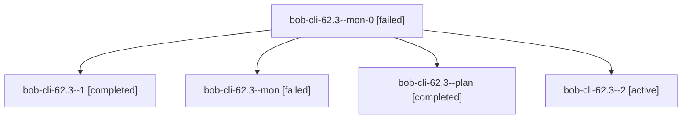

# Session: bob-cli-62.3

[Agent Hoods](../README.md) / [bbugyi200](../users/bbugyi200/README.md) / [athena](../users/bbugyi200/machines/athena/README.md) / [bob-cli-62](../users/bbugyi200/machines/athena/hoods/bob-cli-62/README.md) / bob-cli-62.3

Owner: `bbugyi200.athena` · Hood: `bob-cli-62` · Members: 5 · Bead: [bob-cli-62.3](https://github.com/bobs-org/bob-cli--beads/blob/main/pages/bob-cli-62/bob-cli-62.3.md)

## Lineage

The diagram is an optional enhancement; the ordered table below contains the same lineage in accessible text.

| Role | Agent | State | Model / provider | Timing | Commits | Prompt | Chat |
|---|---|---|---|---|---:|---|---|
| mon-0 | bob-cli-62.3--mon-0 | failed | muse-spark-1.3-contributor / muse | 2026-10-09T21:36:03.681666+00:00 → 2026-10-09T21:40:05.930656+00:00 | 0 | — | [Chat](../agents/bbugyi200.athena.bob-cli-62.3--mon-0/chat.md) |
| 1 | bob-cli-62.3--1 | completed | muse-spark-1.3-contributor / muse | 2026-10-09T21:15:59.836463+00:00 → 2026-10-09T21:38:42.433665+00:00 | 0 | [Prompt](../agents/bbugyi200.athena.bob-cli-62.3--1/prompt.md) | [Chat](../agents/bbugyi200.athena.bob-cli-62.3--1/chat.md) |
| mon | bob-cli-62.3--mon | failed | muse-spark-1.3-contributor / muse | 2026-10-09T21:12:48.922943+00:00 → 2026-10-09T21:16:00.330668+00:00 | 0 | — | [Chat](../agents/bbugyi200.athena.bob-cli-62.3--mon/chat.md) |
| plan | bob-cli-62.3--plan | completed | muse-spark-1.3-contributor / muse | 2026-10-09T20:35:33.773862+00:00 → 2026-10-09T21:14:45.707740+00:00 | 0 | [Prompt](../agents/bbugyi200.athena.bob-cli-62.3--plan/prompt.md) | [Chat](../agents/bbugyi200.athena.bob-cli-62.3--plan/chat.md) |
| 2 | bob-cli-62.3--2 | active | muse-spark-1.3-contributor / muse | 2026-10-09T21:40:05.550011+00:00 | [1](../agents/bbugyi200.athena.bob-cli-62.3--2/README.md#commits) | [Prompt](../agents/bbugyi200.athena.bob-cli-62.3--2/prompt.md) | — |

## Commits

| Role | Repo | Commit | Subject | Committed |
|---|---|---|---|---|
| 2 | bob-cli | [`b1512d6`](https://github.com/bobs-org/bob-cli/commit/b1512d64a76bd2a6bf9096afa0e080aef02a1e21) | feat(highlights-ref): connect scan entrypoints with shared locator index and residence follow-ups | 2026-10-09 17:41:43 EDT |

## Neighbors

| Agent | Relation | State |
|---|---|---|
| [bob-cli-62.1](../agents/bbugyi200.athena.bob-cli-62.1/README.md) | bob-cli-62 hood | completed |
| [bob-cli-62.2](../agents/bbugyi200.athena.bob-cli-62.2/README.md) | bob-cli-62 hood | completed |
| [bob-cli-62.4](../agents/bbugyi200.athena.bob-cli-62.4/README.md) | bob-cli-62 hood | waiting |
| [bob-cli-62.land](../agents/bbugyi200.athena.bob-cli-62.land/README.md) | bob-cli-62 hood | waiting |
