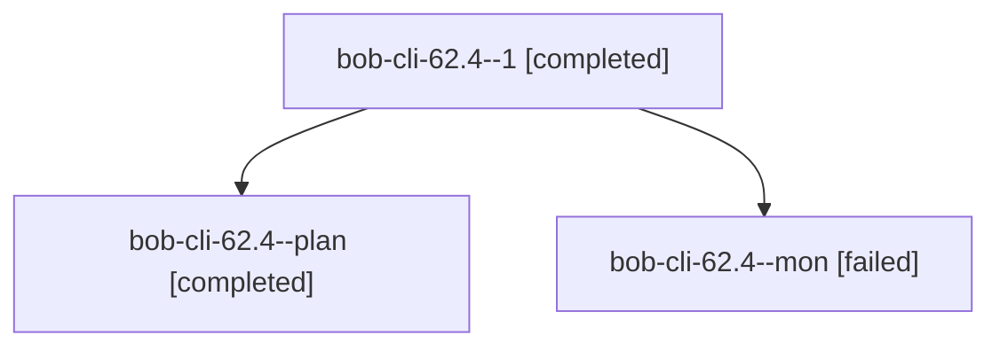

# Session: bob-cli-62.4

[Agent Hoods](../README.md) / [bbugyi200](../users/bbugyi200/README.md) / [athena](../users/bbugyi200/machines/athena/README.md) / [bob-cli-62](../users/bbugyi200/machines/athena/hoods/bob-cli-62/README.md) / bob-cli-62.4

Owner: `bbugyi200.athena` · Hood: `bob-cli-62` · Members: 3 · Bead: [bob-cli-62.4](https://github.com/bobs-org/bob-cli--beads/blob/main/pages/bob-cli-62/bob-cli-62.4.md)

## Lineage

The diagram is an optional enhancement; the ordered table below contains the same lineage in accessible text.

| Role | Agent | State | Model / provider | Timing | Commits | Prompt | Chat |
|---|---|---|---|---|---:|---|---|
| 1 | bob-cli-62.4--1 | completed | muse-spark-1.3-contributor / muse | 2026-10-09T22:24:39.124772+00:00 → 2026-10-09T22:28:11.794427+00:00 | [1](../agents/bbugyi200.athena.bob-cli-62.4--1/README.md#commits) | [Prompt](../agents/bbugyi200.athena.bob-cli-62.4--1/prompt.md) | [Chat](../agents/bbugyi200.athena.bob-cli-62.4--1/chat.md) |
| plan | bob-cli-62.4--plan | completed | muse-spark-1.3-contributor / muse | 2026-10-09T21:44:42.969866+00:00 → 2026-10-09T22:20:18.357972+00:00 | 0 | [Prompt](../agents/bbugyi200.athena.bob-cli-62.4--plan/prompt.md) | [Chat](../agents/bbugyi200.athena.bob-cli-62.4--plan/chat.md) |
| mon | bob-cli-62.4--mon | failed | muse-spark-1.3-contributor / muse | 2026-10-09T22:18:27.682378+00:00 → 2026-10-09T22:21:44.990375+00:00 | 0 | — | [Chat](../agents/bbugyi200.athena.bob-cli-62.4--mon/chat.md) |

## Commits

| Role | Repo | Commit | Subject | Committed |
|---|---|---|---|---|
| 1 | bob-cli | [`61e5c47`](https://github.com/bobs-org/bob-cli/commit/61e5c47e511192d91b5a424da904424cb1aadc84) | docs(ref-sync): finish reports, documentation, and acceptance verification | 2026-10-09 18:26:59 EDT |

## Neighbors

| Agent | Relation | State |
|---|---|---|
| [bob-cli-62.1](../agents/bbugyi200.athena.bob-cli-62.1/README.md) | bob-cli-62 hood | completed |
| [bob-cli-62.2](../agents/bbugyi200.athena.bob-cli-62.2/README.md) | bob-cli-62 hood | completed |
| [bob-cli-62.3](bbugyi200.athena.bob-cli-62.3.md) (session · 5) | bob-cli-62 hood | completed 3, failed 2 |
| [bob-cli-62.land](bbugyi200.athena.bob-cli-62.land.md) (session · 5) | bob-cli-62 hood | active 1, completed 2, failed 2 |
