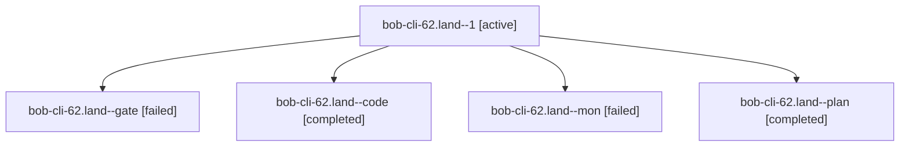

# Session: bob-cli-62.land

[Agent Hoods](../README.md) / [bbugyi200](../users/bbugyi200/README.md) / [athena](../users/bbugyi200/machines/athena/README.md) / [bob-cli-62](../users/bbugyi200/machines/athena/hoods/bob-cli-62/README.md) / bob-cli-62.land

Owner: `bbugyi200.athena` · Hood: `bob-cli-62` · Members: 5 · Bead: [bob-cli-62](https://github.com/bobs-org/bob-cli--beads/blob/main/pages/bob-cli-62/README.md)

## Lineage

The diagram is an optional enhancement; the ordered table below contains the same lineage in accessible text.

| Role | Agent | State | Model / provider | Timing | Commits | Prompt | Chat |
|---|---|---|---|---|---:|---|---|
| 1 | bob-cli-62.land--1 | active | muse-spark-1.3-contributor / muse | 2026-10-09T23:00:56.355877+00:00 | [1](../agents/bbugyi200.athena.bob-cli-62.land--1/README.md#commits) | [Prompt](../agents/bbugyi200.athena.bob-cli-62.land--1/prompt.md) | — |
| gate | bob-cli-62.land--gate | failed | gpt-6.1-sol / codex | 2026-10-09T22:42:40.005459+00:00 → 2026-10-09T22:43:36.947733+00:00 | 0 | — | [Chat](../agents/bbugyi200.athena.bob-cli-62.land--gate/chat.md) |
| code | bob-cli-62.land--code | completed | muse-spark-1.3-contributor / muse | 2026-10-09T22:43:44.271230+00:00 → 2026-10-09T22:57:09.410663+00:00 | 0 | — | [Chat](../agents/bbugyi200.athena.bob-cli-62.land--code/chat.md) |
| mon | bob-cli-62.land--mon | failed | muse-spark-1.3-contributor / muse | 2026-10-09T22:55:42.788809+00:00 → 2026-10-09T22:59:41.771852+00:00 | 0 | — | [Chat](../agents/bbugyi200.athena.bob-cli-62.land--mon/chat.md) |
| plan | bob-cli-62.land--plan | completed | gpt-6.1-sol / codex | 2026-10-09T22:29:32.051664+00:00 → 2026-10-09T22:57:09.410663+00:00 | 0 | [Prompt](../agents/bbugyi200.athena.bob-cli-62.land--plan/prompt.md) | [Chat](../agents/bbugyi200.athena.bob-cli-62.land--plan/chat.md) |

## Commits

| Role | Repo | Commit | Subject | Committed |
|---|---|---|---|---|
| 1 | bob-cli | [`7e838c8`](https://github.com/bobs-org/bob-cli/commit/7e838c80fe5761cc606a1a39280f90e20040b327) | fix(ref-sync): repair v2 acceptance seams and land bob-cli-62 | 2026-10-09 19:04:55 EDT |

## Neighbors

| Agent | Relation | State |
|---|---|---|
| [bob-cli-62.1](../agents/bbugyi200.athena.bob-cli-62.1/README.md) | bob-cli-62 hood | completed |
| [bob-cli-62.2](../agents/bbugyi200.athena.bob-cli-62.2/README.md) | bob-cli-62 hood | completed |
| [bob-cli-62.3](bbugyi200.athena.bob-cli-62.3.md) (session · 5) | bob-cli-62 hood | completed 3, failed 2 |
| [bob-cli-62.4](bbugyi200.athena.bob-cli-62.4.md) (session · 3) | bob-cli-62 hood | completed 2, failed 1 |
