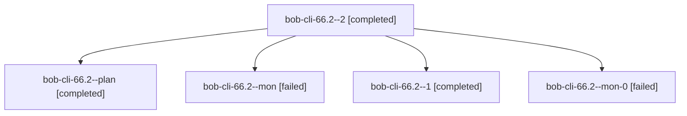

# Session: bob-cli-66.2

[Agent Hoods](../README.md) / [bbugyi200](../users/bbugyi200/README.md) / [athena](../users/bbugyi200/machines/athena/README.md) / [bob-cli-66](../users/bbugyi200/machines/athena/hoods/bob-cli-66/README.md) / bob-cli-66.2

Owner: `bbugyi200.athena` · Hood: `bob-cli-66` · Members: 5 · Bead: [bob-cli-66.2](https://github.com/bobs-org/bob-cli--beads/blob/main/pages/bob-cli-66/bob-cli-66.2.md)

## Lineage

The diagram is an optional enhancement; the ordered table below contains the same lineage in accessible text.

| Role | Agent | State | Model / provider | Timing | Commits | Prompt | Chat |
|---|---|---|---|---|---:|---|---|
| 2 | bob-cli-66.2--2 | completed | muse-spark-1.3-contributor / muse | 2026-10-09T22:57:02.340339+00:00 → 2026-10-09T22:59:02.760529+00:00 | 0 | [Prompt](../agents/bbugyi200.athena.bob-cli-66.2--2/prompt.md) | [Chat](../agents/bbugyi200.athena.bob-cli-66.2--2/chat.md) |
| plan | bob-cli-66.2--plan | completed | muse-spark-1.3-contributor / muse | 2026-10-09T22:29:13.959282+00:00 → 2026-10-09T22:39:18.558825+00:00 | 0 | [Prompt](../agents/bbugyi200.athena.bob-cli-66.2--plan/prompt.md) | [Chat](../agents/bbugyi200.athena.bob-cli-66.2--plan/chat.md) |
| mon | bob-cli-66.2--mon | failed | muse-spark-1.3-contributor / muse | 2026-10-09T22:38:09.974915+00:00 → 2026-10-09T22:43:51.109325+00:00 | 0 | — | [Chat](../agents/bbugyi200.athena.bob-cli-66.2--mon/chat.md) |
| 1 | bob-cli-66.2--1 | completed | muse-spark-1.3-contributor / muse | 2026-10-09T22:45:40.664152+00:00 → 2026-10-09T22:48:50.667125+00:00 | 0 | [Prompt](../agents/bbugyi200.athena.bob-cli-66.2--1/prompt.md) | [Chat](../agents/bbugyi200.athena.bob-cli-66.2--1/chat.md) |
| mon-0 | bob-cli-66.2--mon-0 | failed | muse-spark-1.3-contributor / muse | 2026-10-09T22:48:04.429096+00:00 → 2026-10-09T22:56:33.474360+00:00 | 0 | — | [Chat](../agents/bbugyi200.athena.bob-cli-66.2--mon-0/chat.md) |

## Neighbors

| Agent | Relation | State |
|---|---|---|
| [bob-cli-66.1](../agents/bbugyi200.athena.bob-cli-66.1/README.md) | bob-cli-66 hood | completed |
| [bob-cli-66.3](bbugyi200.athena.bob-cli-66.3.md) (session · 5) | bob-cli-66 hood | completed 3, failed 2 |
| [bob-cli-66.4](../agents/bbugyi200.athena.bob-cli-66.4/README.md) | bob-cli-66 hood | completed |
| [bob-cli-66.5](bbugyi200.athena.bob-cli-66.5.md) (session · 9) | bob-cli-66 hood | completed 5, failed 4 |
| [bob-cli-66.6](bbugyi200.athena.bob-cli-66.6.md) (session · 3) | bob-cli-66 hood | completed 2, failed 1 |
| [bob-cli-66.7](../agents/bbugyi200.athena.bob-cli-66.7/README.md) | bob-cli-66 hood | completed |
| [bob-cli-66.land](bbugyi200.athena.bob-cli-66.land.md) (session · 15) | bob-cli-66 hood | active 1, completed 7, failed 7 |
