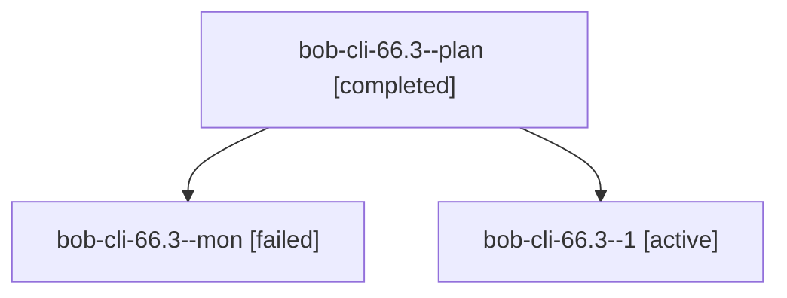

# Session: bob-cli-66.3

[Agent Hoods](../README.md) / [bbugyi200](../users/bbugyi200/README.md) / [athena](../users/bbugyi200/machines/athena/README.md) / [bob-cli-66](../users/bbugyi200/machines/athena/hoods/bob-cli-66/README.md) / bob-cli-66.3

Owner: `bbugyi200.athena` · Hood: `bob-cli-66` · Members: 3 · Bead: [bob-cli-66.3](https://github.com/bobs-org/bob-cli--beads/blob/main/pages/bob-cli-66/bob-cli-66.3.md)

## Lineage

The diagram is an optional enhancement; the ordered table below contains the same lineage in accessible text.

| Role | Agent | State | Model / provider | Timing | Commits | Prompt | Chat |
|---|---|---|---|---|---:|---|---|
| plan | bob-cli-66.3--plan | completed | muse-spark-1.3-contributor / muse | 2026-10-09T22:59:19.593604+00:00 → 2026-10-09T23:17:12.934551+00:00 | 0 | [Prompt](../agents/bbugyi200.athena.bob-cli-66.3--plan/prompt.md) | [Chat](../agents/bbugyi200.athena.bob-cli-66.3--plan/chat.md) |
| mon | bob-cli-66.3--mon | failed | muse-spark-1.3-contributor / muse | 2026-10-09T23:16:41.360757+00:00 → 2026-10-09T23:18:58.489753+00:00 | 0 | — | [Chat](../agents/bbugyi200.athena.bob-cli-66.3--mon/chat.md) |
| 1 | bob-cli-66.3--1 | active | muse-spark-1.3-contributor / muse | 2026-10-09T23:22:19.872114+00:00 | 0 | [Prompt](../agents/bbugyi200.athena.bob-cli-66.3--1/prompt.md) | — |

## Neighbors

| Agent | Relation | State |
|---|---|---|
| [bob-cli-66.1](../agents/bbugyi200.athena.bob-cli-66.1/README.md) | bob-cli-66 hood | completed |
| [bob-cli-66.2](bbugyi200.athena.bob-cli-66.2.md) (session · 5) | bob-cli-66 hood | completed 3, failed 2 |
| [bob-cli-66.4](../agents/bbugyi200.athena.bob-cli-66.4/README.md) | bob-cli-66 hood | active |
| [bob-cli-66.5](../agents/bbugyi200.athena.bob-cli-66.5/README.md) | bob-cli-66 hood | waiting |
| [bob-cli-66.6](../agents/bbugyi200.athena.bob-cli-66.6/README.md) | bob-cli-66 hood | waiting |
| [bob-cli-66.7](../agents/bbugyi200.athena.bob-cli-66.7/README.md) | bob-cli-66 hood | waiting |
| [bob-cli-66.land](../agents/bbugyi200.athena.bob-cli-66.land/README.md) | bob-cli-66 hood | waiting |
