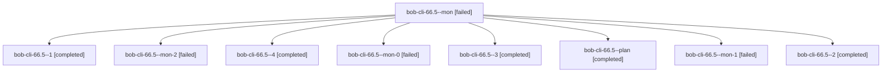

# Session: bob-cli-66.5

[Agent Hoods](../README.md) / [bbugyi200](../users/bbugyi200/README.md) / [athena](../users/bbugyi200/machines/athena/README.md) / [bob-cli-66](../users/bbugyi200/machines/athena/hoods/bob-cli-66/README.md) / bob-cli-66.5

Owner: `bbugyi200.athena` · Hood: `bob-cli-66` · Members: 9 · Bead: [bob-cli-66.5](https://github.com/bobs-org/bob-cli--beads/blob/main/pages/bob-cli-66/bob-cli-66.5.md)

## Lineage

The diagram is an optional enhancement; the ordered table below contains the same lineage in accessible text.

| Role | Agent | State | Model / provider | Timing | Commits | Prompt | Chat |
|---|---|---|---|---|---:|---|---|
| mon | bob-cli-66.5--mon | failed | muse-spark-1.3-contributor / muse | 2026-10-10T00:07:16.616651+00:00 → 2026-10-10T00:11:42.650559+00:00 | 0 | — | [Chat](../agents/bbugyi200.athena.bob-cli-66.5--mon/chat.md) |
| 1 | bob-cli-66.5--1 | completed | muse-spark-1.3-contributor / muse | 2026-10-10T00:12:53.899197+00:00 → 2026-10-10T00:17:27.914871+00:00 | 0 | [Prompt](../agents/bbugyi200.athena.bob-cli-66.5--1/prompt.md) | [Chat](../agents/bbugyi200.athena.bob-cli-66.5--1/chat.md) |
| mon-2 | bob-cli-66.5--mon-2 | failed | muse-spark-1.3-contributor / muse | 2026-10-10T00:44:47.463058+00:00 → 2026-10-10T00:50:09.023010+00:00 | 0 | — | [Chat](../agents/bbugyi200.athena.bob-cli-66.5--mon-2/chat.md) |
| 4 | bob-cli-66.5--4 | completed | muse-spark-1.3-contributor / muse | 2026-10-10T00:51:27.690142+00:00 → 2026-10-10T01:07:04.736356+00:00 | 0 | [Prompt](../agents/bbugyi200.athena.bob-cli-66.5--4/prompt.md) | [Chat](../agents/bbugyi200.athena.bob-cli-66.5--4/chat.md) |
| mon-0 | bob-cli-66.5--mon-0 | failed | muse-spark-1.3-contributor / muse | 2026-10-10T00:16:29.476461+00:00 → 2026-10-10T00:22:00.652968+00:00 | 0 | — | [Chat](../agents/bbugyi200.athena.bob-cli-66.5--mon-0/chat.md) |
| 3 | bob-cli-66.5--3 | completed | muse-spark-1.3-contributor / muse | 2026-10-10T00:41:40.662297+00:00 → 2026-10-10T00:45:22.397426+00:00 | 0 | [Prompt](../agents/bbugyi200.athena.bob-cli-66.5--3/prompt.md) | [Chat](../agents/bbugyi200.athena.bob-cli-66.5--3/chat.md) |
| plan | bob-cli-66.5--plan | completed | muse-spark-1.3-contributor / muse | 2026-10-09T23:44:22.038931+00:00 → 2026-10-10T00:08:42.035048+00:00 | 0 | [Prompt](../agents/bbugyi200.athena.bob-cli-66.5--plan/prompt.md) | [Chat](../agents/bbugyi200.athena.bob-cli-66.5--plan/chat.md) |
| mon-1 | bob-cli-66.5--mon-1 | failed | muse-spark-1.3-contributor / muse | 2026-10-10T00:37:06.503679+00:00 → 2026-10-10T00:40:25.231312+00:00 | 0 | — | [Chat](../agents/bbugyi200.athena.bob-cli-66.5--mon-1/chat.md) |
| 2 | bob-cli-66.5--2 | completed | muse-spark-1.3-contributor / muse | 2026-10-10T00:23:13.705254+00:00 → 2026-10-10T00:38:43.708191+00:00 | 0 | [Prompt](../agents/bbugyi200.athena.bob-cli-66.5--2/prompt.md) | [Chat](../agents/bbugyi200.athena.bob-cli-66.5--2/chat.md) |

## Neighbors

| Agent | Relation | State |
|---|---|---|
| [bob-cli-66.1](../agents/bbugyi200.athena.bob-cli-66.1/README.md) | bob-cli-66 hood | completed |
| [bob-cli-66.2](bbugyi200.athena.bob-cli-66.2.md) (session · 5) | bob-cli-66 hood | completed 3, failed 2 |
| [bob-cli-66.3](bbugyi200.athena.bob-cli-66.3.md) (session · 5) | bob-cli-66 hood | completed 3, failed 2 |
| [bob-cli-66.4](../agents/bbugyi200.athena.bob-cli-66.4/README.md) | bob-cli-66 hood | completed |
| [bob-cli-66.6](bbugyi200.athena.bob-cli-66.6.md) (session · 3) | bob-cli-66 hood | completed 2, failed 1 |
| [bob-cli-66.7](../agents/bbugyi200.athena.bob-cli-66.7/README.md) | bob-cli-66 hood | active |
| [bob-cli-66.land](../agents/bbugyi200.athena.bob-cli-66.land/README.md) | bob-cli-66 hood | waiting |
