# Session: bob-cli-66.land

[Agent Hoods](../README.md) / [bbugyi200](../users/bbugyi200/README.md) / [athena](../users/bbugyi200/machines/athena/README.md) / [bob-cli-66](../users/bbugyi200/machines/athena/hoods/bob-cli-66/README.md) / bob-cli-66.land

Owner: `bbugyi200.athena` · Hood: `bob-cli-66` · Members: 15 · Bead: [bob-cli-66](https://github.com/bobs-org/bob-cli--beads/blob/main/pages/bob-cli-66/README.md)

## Lineage

```mermaid
flowchart TD
  n0["bob-cli-66.land--mon-2 [failed]"]
  n1["bob-cli-66.land--5 [completed]"]
  n0 --> n1
  n2["bob-cli-66.land--mon-0 [failed]"]
  n0 --> n2
  n3["bob-cli-66.land--plan [completed]"]
  n0 --> n3
  n4["bob-cli-66.land--mon-1 [failed]"]
  n0 --> n4
  n5["bob-cli-66.land--gate [failed]"]
  n0 --> n5
  n6["bob-cli-66.land--4 [completed]"]
  n0 --> n6
  n7["bob-cli-66.land--code [completed]"]
  n0 --> n7
  n8["bob-cli-66.land--mon-3 [failed]"]
  n0 --> n8
  n9["bob-cli-66.land--mon-4 [failed]"]
  n0 --> n9
  n10["bob-cli-66.land--2 [completed]"]
  n0 --> n10
  n11["bob-cli-66.land--1 [completed]"]
  n0 --> n11
  n12["bob-cli-66.land--6 [active]"]
  n0 --> n12
  n13["bob-cli-66.land--3 [completed]"]
  n0 --> n13
  n14["bob-cli-66.land--mon [failed]"]
  n0 --> n14
```

The diagram is an optional enhancement; the ordered table below contains the same lineage in accessible text.

| Role | Agent | State | Model / provider | Timing | Commits | Prompt | Chat |
|---|---|---|---|---|---:|---|---|
| mon-2 | bob-cli-66.land--mon-2 | failed | muse-spark-1.3-contributor / muse | 2026-10-10T03:25:37.548813+00:00 → 2026-10-10T03:30:58.481239+00:00 | 0 | — | [Chat](../agents/bbugyi200.athena.bob-cli-66.land--mon-2/chat.md) |
| 5 | bob-cli-66.land--5 | completed | muse-spark-1.3-contributor / muse | 2026-10-10T03:55:24.329221+00:00 → 2026-10-10T04:09:34.324608+00:00 | 0 | [Prompt](../agents/bbugyi200.athena.bob-cli-66.land--5/prompt.md) | [Chat](../agents/bbugyi200.athena.bob-cli-66.land--5/chat.md) |
| mon-0 | bob-cli-66.land--mon-0 | failed | muse-spark-1.3-contributor / muse | 2026-10-10T02:56:02.926605+00:00 → 2026-10-10T03:02:40.265879+00:00 | 0 | — | [Chat](../agents/bbugyi200.athena.bob-cli-66.land--mon-0/chat.md) |
| plan | bob-cli-66.land--plan | completed | opus / claude | 2026-10-10T01:40:46.621025+00:00 → 2026-10-10T02:36:10.305013+00:00 | 0 | [Prompt](../agents/bbugyi200.athena.bob-cli-66.land--plan/prompt.md) | [Chat](../agents/bbugyi200.athena.bob-cli-66.land--plan/chat.md) |
| mon-1 | bob-cli-66.land--mon-1 | failed | muse-spark-1.3-contributor / muse | 2026-10-10T03:15:01.809837+00:00 → 2026-10-10T03:19:38.055707+00:00 | 0 | — | [Chat](../agents/bbugyi200.athena.bob-cli-66.land--mon-1/chat.md) |
| gate | bob-cli-66.land--gate | failed | opus / claude | 2026-10-10T02:12:10.493957+00:00 → 2026-10-10T02:13:00.840498+00:00 | 0 | — | [Chat](../agents/bbugyi200.athena.bob-cli-66.land--gate/chat.md) |
| 4 | bob-cli-66.land--4 | completed | muse-spark-1.3-contributor / muse | 2026-10-10T03:31:43.806280+00:00 → 2026-10-10T03:49:30.167875+00:00 | 0 | [Prompt](../agents/bbugyi200.athena.bob-cli-66.land--4/prompt.md) | [Chat](../agents/bbugyi200.athena.bob-cli-66.land--4/chat.md) |
| code | bob-cli-66.land--code | completed | muse-spark-1.3-contributor / muse | 2026-10-10T02:13:16.981044+00:00 → 2026-10-10T02:36:10.305013+00:00 | 0 | — | [Chat](../agents/bbugyi200.athena.bob-cli-66.land--code/chat.md) |
| mon-3 | bob-cli-66.land--mon-3 | failed | muse-spark-1.3-contributor / muse | 2026-10-10T03:48:59.718940+00:00 → 2026-10-10T03:54:30.441686+00:00 | 0 | — | [Chat](../agents/bbugyi200.athena.bob-cli-66.land--mon-3/chat.md) |
| mon-4 | bob-cli-66.land--mon-4 | failed | muse-spark-1.3-contributor / muse | 2026-10-10T04:08:57.848197+00:00 → 2026-10-10T04:13:13.647716+00:00 | 0 | — | [Chat](../agents/bbugyi200.athena.bob-cli-66.land--mon-4/chat.md) |
| 2 | bob-cli-66.land--2 | completed | muse-spark-1.3-contributor / muse | 2026-10-10T03:05:09.534663+00:00 → 2026-10-10T03:15:36.869239+00:00 | 0 | [Prompt](../agents/bbugyi200.athena.bob-cli-66.land--2/prompt.md) | [Chat](../agents/bbugyi200.athena.bob-cli-66.land--2/chat.md) |
| 1 | bob-cli-66.land--1 | completed | muse-spark-1.3-contributor / muse | 2026-10-10T02:41:00.869077+00:00 → 2026-10-10T02:59:28.852470+00:00 | 0 | [Prompt](../agents/bbugyi200.athena.bob-cli-66.land--1/prompt.md) | [Chat](../agents/bbugyi200.athena.bob-cli-66.land--1/chat.md) |
| 6 | bob-cli-66.land--6 | active | muse-spark-1.3-contributor / muse | 2026-10-10T04:13:59.959559+00:00 | [1](../agents/bbugyi200.athena.bob-cli-66.land--6/README.md#commits) | [Prompt](../agents/bbugyi200.athena.bob-cli-66.land--6/prompt.md) | — |
| 3 | bob-cli-66.land--3 | completed | muse-spark-1.3-contributor / muse | 2026-10-10T03:20:21.903541+00:00 → 2026-10-10T03:26:12.384300+00:00 | 0 | [Prompt](../agents/bbugyi200.athena.bob-cli-66.land--3/prompt.md) | [Chat](../agents/bbugyi200.athena.bob-cli-66.land--3/chat.md) |
| mon | bob-cli-66.land--mon | failed | muse-spark-1.3-contributor / muse | 2026-10-10T02:35:42.272891+00:00 → 2026-10-10T02:40:26.456912+00:00 | 0 | — | [Chat](../agents/bbugyi200.athena.bob-cli-66.land--mon/chat.md) |

## Commits

| Role | Repo | Commit | Subject | Committed |
|---|---|---|---|---|
| 6 | bob-cli | [`0f8ff5a`](https://github.com/bobs-org/bob-cli/commit/0f8ff5ac74f246207bf1c27cafe043194948b33c) | feat(agenda): idle capture agenda Part A fixes A1-A6 with null-key goldens | 2026-10-10 00:24:58 EDT |

## Neighbors

| Agent | Relation | State |
|---|---|---|
| [bob-cli-66.1](../agents/bbugyi200.athena.bob-cli-66.1/README.md) | bob-cli-66 hood | completed |
| [bob-cli-66.2](bbugyi200.athena.bob-cli-66.2.md) (session · 5) | bob-cli-66 hood | completed 3, failed 2 |
| [bob-cli-66.3](bbugyi200.athena.bob-cli-66.3.md) (session · 5) | bob-cli-66 hood | completed 3, failed 2 |
| [bob-cli-66.4](../agents/bbugyi200.athena.bob-cli-66.4/README.md) | bob-cli-66 hood | completed |
| [bob-cli-66.5](bbugyi200.athena.bob-cli-66.5.md) (session · 9) | bob-cli-66 hood | completed 5, failed 4 |
| [bob-cli-66.6](bbugyi200.athena.bob-cli-66.6.md) (session · 3) | bob-cli-66 hood | completed 2, failed 1 |
| [bob-cli-66.7](../agents/bbugyi200.athena.bob-cli-66.7/README.md) | bob-cli-66 hood | completed |
