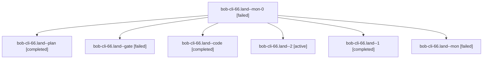

# Session: bob-cli-66.land

[Agent Hoods](../README.md) / [bbugyi200](../users/bbugyi200/README.md) / [athena](../users/bbugyi200/machines/athena/README.md) / [bob-cli-66](../users/bbugyi200/machines/athena/hoods/bob-cli-66/README.md) / bob-cli-66.land

Owner: `bbugyi200.athena` · Hood: `bob-cli-66` · Members: 7 · Bead: [bob-cli-66](https://github.com/bobs-org/bob-cli--beads/blob/main/pages/bob-cli-66/README.md)

## Lineage

The diagram is an optional enhancement; the ordered table below contains the same lineage in accessible text.

| Role | Agent | State | Model / provider | Timing | Commits | Prompt | Chat |
|---|---|---|---|---|---:|---|---|
| mon-0 | bob-cli-66.land--mon-0 | failed | muse-spark-1.3-contributor / muse | 2026-10-10T02:56:02.926605+00:00 → 2026-10-10T03:02:40.265879+00:00 | 0 | — | [Chat](../agents/bbugyi200.athena.bob-cli-66.land--mon-0/chat.md) |
| plan | bob-cli-66.land--plan | completed | opus / claude | 2026-10-10T01:40:46.621025+00:00 → 2026-10-10T02:36:10.305013+00:00 | 0 | [Prompt](../agents/bbugyi200.athena.bob-cli-66.land--plan/prompt.md) | [Chat](../agents/bbugyi200.athena.bob-cli-66.land--plan/chat.md) |
| gate | bob-cli-66.land--gate | failed | opus / claude | 2026-10-10T02:12:10.493957+00:00 → 2026-10-10T02:13:00.840498+00:00 | 0 | — | [Chat](../agents/bbugyi200.athena.bob-cli-66.land--gate/chat.md) |
| code | bob-cli-66.land--code | completed | muse-spark-1.3-contributor / muse | 2026-10-10T02:13:16.981044+00:00 → 2026-10-10T02:36:10.305013+00:00 | 0 | — | [Chat](../agents/bbugyi200.athena.bob-cli-66.land--code/chat.md) |
| 2 | bob-cli-66.land--2 | active | muse-spark-1.3-contributor / muse | 2026-10-10T03:05:09.534663+00:00 | 0 | [Prompt](../agents/bbugyi200.athena.bob-cli-66.land--2/prompt.md) | — |
| 1 | bob-cli-66.land--1 | completed | muse-spark-1.3-contributor / muse | 2026-10-10T02:41:00.869077+00:00 → 2026-10-10T02:59:28.852470+00:00 | 0 | [Prompt](../agents/bbugyi200.athena.bob-cli-66.land--1/prompt.md) | [Chat](../agents/bbugyi200.athena.bob-cli-66.land--1/chat.md) |
| mon | bob-cli-66.land--mon | failed | muse-spark-1.3-contributor / muse | 2026-10-10T02:35:42.272891+00:00 → 2026-10-10T02:40:26.456912+00:00 | 0 | — | [Chat](../agents/bbugyi200.athena.bob-cli-66.land--mon/chat.md) |

## Neighbors

| Agent | Relation | State |
|---|---|---|
| [bob-cli-66.1](../agents/bbugyi200.athena.bob-cli-66.1/README.md) | bob-cli-66 hood | completed |
| [bob-cli-66.2](bbugyi200.athena.bob-cli-66.2.md) (session · 5) | bob-cli-66 hood | completed 3, failed 2 |
| [bob-cli-66.3](bbugyi200.athena.bob-cli-66.3.md) (session · 5) | bob-cli-66 hood | completed 3, failed 2 |
| [bob-cli-66.4](../agents/bbugyi200.athena.bob-cli-66.4/README.md) | bob-cli-66 hood | completed |
| [bob-cli-66.5](bbugyi200.athena.bob-cli-66.5.md) (session · 9) | bob-cli-66 hood | completed 5, failed 4 |
| [bob-cli-66.6](bbugyi200.athena.bob-cli-66.6.md) (session · 3) | bob-cli-66 hood | completed 2, failed 1 |
| [bob-cli-66.7](../agents/bbugyi200.athena.bob-cli-66.7/README.md) | bob-cli-66 hood | completed |
