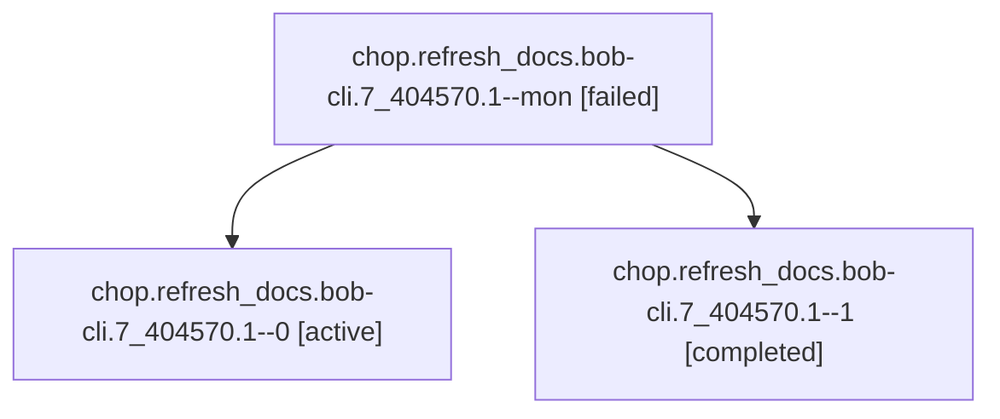

# Session: chop.refresh\_docs.bob-cli.7\_404570.1

[Agent Hoods](../README.md) / [bbugyi200](../users/bbugyi200/README.md) / [athena](../users/bbugyi200/machines/athena/README.md) / [chop](../users/bbugyi200/machines/athena/hoods/chop/README.md) / chop.refresh\_docs.bob-cli.7\_404570.1

Owner: `bbugyi200.athena` · Hood: `chop` · Members: 3

## Lineage

The diagram is an optional enhancement; the ordered table below contains the same lineage in accessible text.

| Role | Agent | State | Model / provider | Timing | Commits | Prompt | Chat |
|---|---|---|---|---|---:|---|---|
| mon | chop.refresh\_docs.bob-cli.7\_404570.1--mon | failed | gpt-6.1-sol / codex | 2026-10-04T07:14:23.317614+00:00 → 2026-10-04T07:16:38.628345+00:00 | 0 | — | [Chat](../agents/bbugyi200.athena.chop.refresh_docs.bob-cli.7_404570.1--mon/chat.md) |
| 0 | chop.refresh\_docs.bob-cli.7\_404570.1--0 | active | gpt-6.1-sol / codex | 2026-10-04T06:58:48.642243+00:00 | 0 | [Prompt](../agents/bbugyi200.athena.chop.refresh_docs.bob-cli.7_404570.1--0/prompt.md) | [Chat](../agents/bbugyi200.athena.chop.refresh_docs.bob-cli.7_404570.1--0/chat.md) |
| 1 | chop.refresh\_docs.bob-cli.7\_404570.1--1 | completed | gpt-6.1-sol / codex | 2026-10-04T07:17:03.573321+00:00 → 2026-10-04T07:22:00.327259+00:00 | [1](../agents/bbugyi200.athena.chop.refresh_docs.bob-cli.7_404570.1--1/README.md#commits) | [Prompt](../agents/bbugyi200.athena.chop.refresh_docs.bob-cli.7_404570.1--1/prompt.md) | [Chat](../agents/bbugyi200.athena.chop.refresh_docs.bob-cli.7_404570.1--1/chat.md) |

## Commits

| Role | Repo | Commit | Subject | Committed |
|---|---|---|---|---|
| 1 | bob-cli | [`bb24471`](https://github.com/bobs-org/bob-cli/commit/bb244716c74c29dbf23a1f5caacf80ad9702b834) | docs: refresh onboarding and current workflow contracts | 2026-10-04 03:19:00 EDT |

## Neighbors

| Agent | Relation | State |
|---|---|---|
| [chop.refresh\_docs.bob-cli.7\_404570.2](../agents/bbugyi200.athena.chop.refresh_docs.bob-cli.7_404570.2/README.md) | chop.refresh\_docs.bob-cli.7\_404570 hood | active |
| [chop.refresh\_docs.bob-cli.0\_794067.1](../agents/bbugyi200.athena.chop.refresh_docs.bob-cli.0_794067.1/README.md) | chop.refresh\_docs.bob-cli hood | active |
| [chop.refresh\_docs.bob-cli.0\_794067.2](../agents/bbugyi200.athena.chop.refresh_docs.bob-cli.0_794067.2/README.md) | chop.refresh\_docs.bob-cli hood | active |
| [chop.refresh\_docs.bob-cli.1](../agents/bbugyi200.athena.chop.refresh_docs.bob-cli.1/README.md) | chop.refresh\_docs.bob-cli hood | active |
| [chop.refresh\_docs.bob-cli.1\_039411.1](../agents/bbugyi200.athena.chop.refresh_docs.bob-cli.1_039411.1/README.md) | chop.refresh\_docs.bob-cli hood | active |
| [chop.refresh\_docs.bob-cli.1\_039411.2](../agents/bbugyi200.athena.chop.refresh_docs.bob-cli.1_039411.2/README.md) | chop.refresh\_docs.bob-cli hood | active |
| [chop.refresh\_docs.bob-cli.2](../agents/bbugyi200.athena.chop.refresh_docs.bob-cli.2/README.md) | chop.refresh\_docs.bob-cli hood | active |
| [chop.refresh\_docs.bob-cli.4\_902214.1](../agents/bbugyi200.athena.chop.refresh_docs.bob-cli.4_902214.1/README.md) | chop.refresh\_docs.bob-cli hood | waiting |
| [chop.refresh\_docs.bob-cli.4\_902214.2](../agents/bbugyi200.athena.chop.refresh_docs.bob-cli.4_902214.2/README.md) | chop.refresh\_docs.bob-cli hood | waiting |
| [chop.refresh\_docs.bob-cli.6\_827232.1](../agents/bbugyi200.athena.chop.refresh_docs.bob-cli.6_827232.1/README.md) | chop.refresh\_docs.bob-cli hood | active |
| [chop.refresh\_docs.bob-cli.6\_827232.2](../agents/bbugyi200.athena.chop.refresh_docs.bob-cli.6_827232.2/README.md) | chop.refresh\_docs.bob-cli hood | active |
| [chop.refresh\_docs.bob-cli.8\_302405.1](../agents/bbugyi200.athena.chop.refresh_docs.bob-cli.8_302405.1/README.md) | chop.refresh\_docs.bob-cli hood | active |
| [chop.refresh\_docs.bob-cli.8\_302405.2](../agents/bbugyi200.athena.chop.refresh_docs.bob-cli.8_302405.2/README.md) | chop.refresh\_docs.bob-cli hood | waiting |
| [chop.refresh\_docs.bob-cli.9\_066735.1](../agents/bbugyi200.athena.chop.refresh_docs.bob-cli.9_066735.1/README.md) | chop.refresh\_docs.bob-cli hood | active |
| [chop.refresh\_docs.bob-cli.9\_066735.2](../agents/bbugyi200.athena.chop.refresh_docs.bob-cli.9_066735.2/README.md) | chop.refresh\_docs.bob-cli hood | active |
