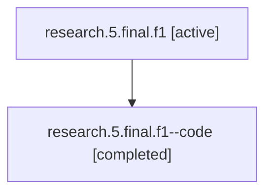

# Session: research.5.final.f1

[Agent Hoods](../README.md) / [bbugyi200](../users/bbugyi200/README.md) / [athena](../users/bbugyi200/machines/athena/README.md) / [research](../users/bbugyi200/machines/athena/hoods/research/README.md) / research.5.final.f1

Owner: `bbugyi200.athena` · Hood: `research` · Members: 2

## Lineage

The diagram is an optional enhancement; the ordered table below contains the same lineage in accessible text.

| Role | Agent | State | Model / provider | Timing | Commits | Prompt | Chat |
|---|---|---|---|---|---:|---|---|
| root | research.5.final.f1 | active | gpt-5.5 / codex | 2026-07-09T16:52:03.066905+00:00 | 0 | [Prompt](../agents/bbugyi200.athena.research.5.final.f1/prompt.md) | [Chat](../agents/bbugyi200.athena.research.5.final.f1/chat.md) |
| code | research.5.final.f1--code | completed | gpt-5.5 / codex | 2026-07-09T16:54:32.673033+00:00 | 0 | — | [Chat](../agents/bbugyi200.athena.research.5.final.f1--code/chat.md) |

## Neighbors

| Agent | Relation | State |
|---|---|---|
| [research.5.final](../agents/bbugyi200.athena.research.5.final/README.md) | ancestor | active |
| [research.5.cdx](../agents/bbugyi200.athena.research.5.cdx/README.md) | research.5 hood | active |
| [research.5.cld](../agents/bbugyi200.athena.research.5.cld/README.md) | research.5 hood | active |
| [research.5.image](../agents/bbugyi200.athena.research.5.image/README.md) | research.5 hood | active |
| [research.0.cdx](../agents/bbugyi200.athena.research.0.cdx/README.md) | research hood | completed |
| [research.0.cld](../agents/bbugyi200.athena.research.0.cld/README.md) | research hood | completed |
| [research.0.final](../agents/bbugyi200.athena.research.0.final/README.md) | research hood | completed |
| [research.0.final.f1](../agents/bbugyi200.athena.research.0.final.f1/README.md) | research hood | completed |
| [research.0.image](../agents/bbugyi200.athena.research.0.image/README.md) | research hood | completed |
| [research.0h.cdx](../agents/bbugyi200.athena.research.0h.cdx/README.md) | research hood | active |
| [research.0h.cld](../agents/bbugyi200.athena.research.0h.cld/README.md) | research hood | active |
| [research.0h.final](../agents/bbugyi200.athena.research.0h.final/README.md) | research hood | active |
| [research.0h.image](../agents/bbugyi200.athena.research.0h.image/README.md) | research hood | active |
| [research.0m.cdx](../agents/bbugyi200.athena.research.0m.cdx/README.md) | research hood | completed |
| [research.0m.cld](../agents/bbugyi200.athena.research.0m.cld/README.md) | research hood | completed |
| [research.0m.final](../agents/bbugyi200.athena.research.0m.final/README.md) | research hood | completed |
| [research.0m.image](../agents/bbugyi200.athena.research.0m.image/README.md) | research hood | completed |
| [research.1a.cdx](../agents/bbugyi200.athena.research.1a.cdx/README.md) | research hood | active |
| [research.1a.cld](../agents/bbugyi200.athena.research.1a.cld/README.md) | research hood | active |
| [research.1a.final](../agents/bbugyi200.athena.research.1a.final/README.md) | research hood | active |
| [research.1a.image](../agents/bbugyi200.athena.research.1a.image/README.md) | research hood | active |
| [research.2o.cdx](../agents/bbugyi200.athena.research.2o.cdx/README.md) | research hood | active |
| [research.2o.final](../agents/bbugyi200.athena.research.2o.final/README.md) | research hood | active |
| [research.2o.gem](../agents/bbugyi200.athena.research.2o.gem/README.md) | research hood | active |
| [research.2o.grk](../agents/bbugyi200.athena.research.2o.grk/README.md) | research hood | active |
| [research.2o.image](../agents/bbugyi200.athena.research.2o.image/README.md) | research hood | active |
| [research.2o.mus](../agents/bbugyi200.athena.research.2o.mus/README.md) | research hood | active |
| [research.31.cdx](../agents/bbugyi200.athena.research.31.cdx/README.md) | research hood | active |
| [research.31.cld](../agents/bbugyi200.athena.research.31.cld/README.md) | research hood | active |
| [research.31.final](../agents/bbugyi200.athena.research.31.final/README.md) | research hood | active |
| [research.31.gem](../agents/bbugyi200.athena.research.31.gem/README.md) | research hood | active |
| [research.31.grk](../agents/bbugyi200.athena.research.31.grk/README.md) | research hood | active |
| [research.31.image](../agents/bbugyi200.athena.research.31.image/README.md) | research hood | active |
| [research.31.linker](../agents/bbugyi200.athena.research.31.linker/README.md) | research hood | active |
| [research.31.mus](../agents/bbugyi200.athena.research.31.mus/README.md) | research hood | active |
| [research.32.cdx](../agents/bbugyi200.athena.research.32.cdx/README.md) | research hood | active |
| [research.32.cld](../agents/bbugyi200.athena.research.32.cld/README.md) | research hood | active |
| [research.32.final](../agents/bbugyi200.athena.research.32.final/README.md) | research hood | active |
| [research.32.gem](../agents/bbugyi200.athena.research.32.gem/README.md) | research hood | active |
| [research.32.grk](../agents/bbugyi200.athena.research.32.grk/README.md) | research hood | active |
| [research.32.image](../agents/bbugyi200.athena.research.32.image/README.md) | research hood | active |
| [research.32.linker](../agents/bbugyi200.athena.research.32.linker/README.md) | research hood | active |
| [research.32.mus](../agents/bbugyi200.athena.research.32.mus/README.md) | research hood | active |
| [research.35.cdx](../agents/bbugyi200.athena.research.35.cdx/README.md) | research hood | active |
| [research.35.cld](../agents/bbugyi200.athena.research.35.cld/README.md) | research hood | active |
| [research.35.final](../agents/bbugyi200.athena.research.35.final/README.md) | research hood | active |
| [research.35.gem](../agents/bbugyi200.athena.research.35.gem/README.md) | research hood | active |
| [research.35.grk](../agents/bbugyi200.athena.research.35.grk/README.md) | research hood | active |
| [research.35.image](../agents/bbugyi200.athena.research.35.image/README.md) | research hood | active |
| [research.35.linker](../agents/bbugyi200.athena.research.35.linker/README.md) | research hood | active |
| [research.35.mus](../agents/bbugyi200.athena.research.35.mus/README.md) | research hood | active |
| [research.39.cdx](../agents/bbugyi200.athena.research.39.cdx/README.md) | research hood | active |
| [research.39.cld](../agents/bbugyi200.athena.research.39.cld/README.md) | research hood | active |
| [research.39.final](../agents/bbugyi200.athena.research.39.final/README.md) | research hood | active |
| … and 94 more in the [hood roster](../users/bbugyi200/machines/athena/hoods/research/README.md) | research hood | — |
